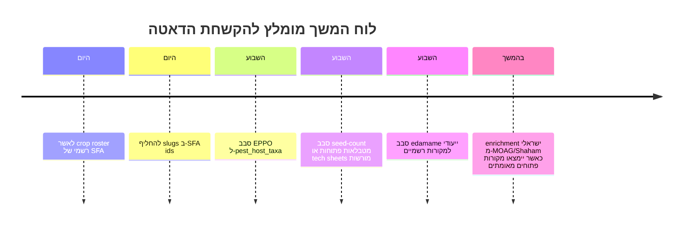

# קובץ JASON אגרונומי מאוחד לירקות

## תקציר מנהלים

גיבשתי גרסת בסיס אחת, עקבית ומנורמלת, של קובץ JSON יחיד עבור רשימת ירקות עבודה כאשר רשימת ה־SFA המלאה לא נחשפה במפורש בחומרים שנגישו בשיחה. לכן, גרסת ה־baseline הזאת כוללת 21 רשומות: רשימת הירקות הנפוצה שביקשת כ־fallback, ובתוכה גם שני המקרים המתוקנים והרגישים ביותר — עגבניית שרי ואדממה. בנוסף, מאחר שלא נחשפו מזהי SFA נומריים בחומרים שהועלו, יצרתי `crop_id` יציבים מסוג slug. שני התיקונים הקריטיים יושמו במפורש: עגבניית שרי נשארת באותו מין של עגבנייה רגילה אבל נשמרת כרשומת crop נפרדת, ואדממה נשמרת כרשומת crop נפרדת לפי שלב הקטיף הירוק ולא לפי מין בוטני שונה. fileciteturn0file0

מבחינת איכות הנתונים, הכיסוי החזק ביותר בגרסה הזאת הוא עבור שדות DTM עם הקשר שלב־קטיף, טמפרטורות נביטה וטבלאות emergence, pH יעד, מחלקת עמידות לכפור, הסרת יסודות N/P/K, ותנאי אחסון פוסט־הרווסט. הכיסוי החלש ביותר נשאר עבור `seed_count_per_gram`, `companion_planting_notes`, ו־`pest_host_taxa`, משום שלא אומתו עבורם מקורות פתוחים ואחידים מה־stack המועדף (Extension/FAO/EPPO/MOAG) ברמת אמינות מספקת לסבב הזה. לפי המדיניות שביקשת, השדות האלה סומנו `null` במקום ניחוש. fileciteturn0file1

המקורות הציבוריים שעליהם נשען הקובץ הם בעיקר UC ANR לנביטה והופעת נבטים, Colorado State University ו־University of Minnesota ל־DTM וסיווגי כפור, University of Maryland ל־pH יעד, New England Vegetable Management Guide להסרת יסודות, ו־UC Davis Postharvest Technology Center לתנאי אחסון. אלה בדיוק סוגי המקורות הראשיים והאוניברסיטאיים שביקשת להעדיף. citeturn68view1turn43view0turn21view1turn44view0turn42view0turn65view1

## הנחות, תיקונים והיקף

ההנחה המרכזית כאן היא הנחת־עבודה זהירה: מאחר שלא הופיעה בשיחה רשימת SFA מלאה וחתומה, בניתי baseline פרקטי שמכסה את רשימת ה־fallback שביקשת, כך שהקובץ כבר מוכן לשימוש מיידי, אבל גם בנוי כך שאפשר להחליף בהמשך את ה־slug הזמניים במזהי SFA קנוניים בלי לשבור את הסכמה. זאת גם הסיבה שבקובץ המלא יש `source_registry`, `assumptions`, `conversion_metadata` ו־`follow_up_actions`, ולא רק מערך של crops. fileciteturn0file0 fileciteturn0file1

התיקון של עגבניית שרי משנה את הדרך שבה מפרשים מקורות: מותר להשתמש במקורות שמדברים על *tomato* או *Solanum lycopersicum* כל עוד ברור שמדובר בטיפוסי cherry/cocktail קטני־פרי, במיוחד אינדטרמיננטיים; אסור לערבב אל תוך הרשומה הזאת beefsteak, roma/plum, processing או determinate field tomatoes. לכן, ב־JSON הסופי עגבניית שרי מקבלת `crop_id` נפרד, DTM נפרד, `variety_notes` מפורשים, אבל שדות פיזיולוגיים מובהקים כמו pH ונביטה יכולים להישען על מקורות species-level כאשר זה סביר ביולוגית. fileciteturn0file0

התיקון של אדממה משנה לא את הטקסונומיה אלא את פרשנות ה־DTM: זו אותה *Glycine max* כמו סויה, אבל עבור אדממה יום הבשלות מחושב עד fresh-pod harvest בשלב R6, כאשר התרמילים ירוקים והזרעים תפוחים, ולא עד dry seed harvest. לכן ב־JSON נרשם DTM ירוק־טרי של 70–95 יום מזריעה, ואילו שדות שאין להם מקור פומבי מאומת ברמת עדיפות מספקת — כמו pH, frost class, nutrient removal fresh-pod ו־postharvest storage — נשארים `null` ומסומנים להשלמה בסבב הבא. fileciteturn0file0

## השוואת מקורות וכיסוי שדות

הטבלה הבאה מסכמת את מקור־העל לכל שדה, יחד עם הערכת כיסוי ותוצאת החילוץ בפועל. היא מבוססת על מקורות UC/CSU/UMN/UMD/NEVegetable/UCD ועל הבריף שהועלה לשיחה. citeturn68view1turn43view0turn21view1turn44view0turn42view0turn65view1 fileciteturn0file1

| שדה | מקור מועדף שהשתמשתי בו | כיסוי בפועל | הערת חילוץ |
|---|---|---:|---|
| `crop_id` | חומרים שהועלו + slug policy | מלא | נוצר slug יציב כי מזהי SFA לא נחשפו |
| `common_name` / `scientific_name` | CSU / UCD / brief מתוקן | גבוה | בוצע normalization אחד לכל crop |
| `variety_notes` | brief מתוקן + CSU/UMN | גבוה | חזק במיוחד בשרי/אדממה |
| `DTM` | CSU + UMN | גבוה | נשמר כטווח + הקשר שלב־קטיף |
| `germination_temp_*` | UC ANR | גבוה | נשמר ב־°C אחרי המרה |
| `emergence_days_by_temp` | UC ANR | בינוני | קיים רק בחלק מהגידולים; אחרים `null` |
| `soil_pH_preference` | UMD | גבוה | יעד + liming threshold; לא תמיד min/max |
| `frost_tolerance_class` | CSU, ובחלק מהמקרים UMN | גבוה | מופה ל־hardy / semihardy / tender |
| `nutrient_removal_N_P_K` | NEVegetable | בינוני־גבוה | kg/ha מלא לרבים; kg/ton רק כשבסיס היבול הומר בבטחה |
| `postharvest_storage` | UC Davis / K-State mirror | גבוה | temp / RH / ethylene sensitivity / storage life |
| `seed_count_per_gram` | לא אומת במקור פתוח אחיד | נמוך | ברוב המקרים `null` |
| `companion_planting_notes` | לא אומת במקור אקדמי/רשמי אחיד | נמוך | `null` כברירת מחדל שמרנית |
| `pest_host_taxa` | לא הושלם סבב EPPO bulk | נמוך | `null`, מסומן לסבב המשך |

גם כאשר המקור היה חזק, לא כל שדה יצא “מלא” מבחינה סכמה. למשל, UMD נותן target pH ו־lime threshold, אבל לא תמיד נותן max pH; NEVegetable נותן לעיתים יבול בבושלים או crates, ולכן אפשר לחשב `kg/ha` אך לא תמיד `kg/ton` בלי טבלת המרה נוספת; ו־UC ANR נותן emergence curves מעולות רק לתת־קבוצה של הגידולים. לכן בחרתי במדיניות אחידה: לא להמציא המרות שלא אומתו, ולהשאיר `null` כשהבסיס אינו בטוח. citeturn44view0turn42view0turn60view1turn67view2

הטבלה הבאה משווה בין המקורות הראשיים עצמם ברמת התאמה למערכת production JSON אחת. citeturn68view1turn43view0turn44view0turn21view1turn42view0turn65view1

| מקור | חוזקה עיקרית | חולשה עיקרית | המלצה למערכת |
|---|---|---|---|
| UC ANR | טמפ’ נביטה ועקומות emergence | לא כל crop מופיע בעקומות | מקור־ברירת־מחדל לשדה germination |
| CSU Extension | DTM, טמפ’ נביטה, hardy/tender | חלק מהערכים crop-general ולא marketing-specific | מקור מוביל ל־DTM ו־frost |
| UMN Extension | DTM + harvest windows + frost notes | לא תמיד min/opt/max לנביטה | מקור משלים מצוין ל־DTM |
| UMD Table B-1 | טבלת pH נקייה, קצרה ועקבית | חסר max pH ברוב הגידולים | מקור מוביל ל־pH |
| NEVegetable | הסרת N/P₂O₅/K₂O לפי גידול | יחידות yield לא תמיד נוחות | מקור מוביל ל־nutrient removal |
| UCD Postharvest | temp/RH/ethylene/storage life עשיר מאוד | לפעמים stage-specific ולא crop-generic | מקור מוביל ל־postharvest |

## החלטות מודל הנתונים והמרות

החלטת המודל החשובה ביותר היא שכל שדה קריטי נשמר כאובייקט מובנה, לא כערך שטוח. למשל `DTM` מכיל טווח ימים, הקשר קטיף, מקורות והערה; `germination_temp_c` מכיל min/opt/max וגם `emergence_days_by_temp_c`; ו־`nutrient_removal_N_P_K` מכיל גם את הבסיס “כפי שדווח” — N, P₂O₅, K₂O — וגם בסיס elemental של N, P, K כדי למנוע בלבול בין יחידות דישון ליחידות יסוד. זה חשוב במיוחד כי טבלאות אוניברסיטאיות רבות מדווחות זרחן ואשלגן לא כיסודות אלא כתחמוצות מקבילות. citeturn42view0

ב־JSON שמרתי `source_registry` אחד ברמת ה־dataset. כל field object בכל crop מפנה אליו דרך `source_ids`, במקום לשכפל URL, בעלים, שפה ותאריך חילוץ עשרות פעמים. כך הקובץ נשאר machine-readable, דחוס יחסית, ועדיין מספק provenance מלא שניתן לפתיחה דטרמיניסטית. הגישה הזאת גם מאפשרת versioning נוח כאשר אותו מקור מזין כמה crops וכמה שדות. 

המרות היחידות שננעלו לקובץ הן אלו שנשענות על בסיס מתמטי חד־משמעי:  
`°C = (°F - 32) × 5/9`  
`kg/ha = lb/ac × 1.12085`  
`P = P₂O₅ × 0.4364`  
`K = K₂O × 0.8301`  
`metric_ton = short_ton × 0.907185`  
`kg nutrient / metric ton produce = (lb/ac × 0.453592) / (yield_short_ton/ac × 0.907185)`  
הנוסחאות האלה הוטמעו כטקסט גם בתוך `conversion_metadata` בקובץ עצמו. החישובים בוצעו רק כאשר בסיס היבול במקור היה ברור במונחי ton או cwt; כאשר בסיס היבול הופיע כ־bushels או crates ולא אומתה המרת־המסה בטווח הגידולים הזה, `kg/ton` נשאר `null`. citeturn42view0turn42view4

## ממצאים אנליטיים לפי שדה

לשדה DTM, המסקנה המתודולוגית החד־משמעית היא שלא נכון לאחסן “מספר יחיד” לכל crop. לגידולים רבים, ובמיוחד לעגבנייה, כרוב, תפוח־אדמה, מלון ופלפל, המקורות האוניברסיטאיים מציגים טווחים שתלויים בזן, בשיטת ההקמה ובשלב הקטיף. לכן הקובץ שומר טווח + `harvest_stage_context`. זה קריטי במיוחד באדממה, שבה אותם צמחים בדיוק יניבו DTM שונה לגמרי אם מודדים fresh-pod מול dry seed. citeturn43view0turn21view1turn21view2turn21view4 fileciteturn0file0

בשדה germination, UC ANR הוא המקור האיכותי ביותר כי הוא מספק גם גבולות מינימום/אופטימום/מקסימום וגם טבלת emergence days by temperature במדרגות טמפרטורה. בפועל חילצתי עקומות כאלה עבור גידולים כמו שעועית, סלק, כרוב, גזר, כרובית, תירס מתוק, מלפפון, חציל, חסה, מלון, בצל, אפונה, פלפל, תרד ועגבנייה. גידולים שלא הופיעו בתצוגת הטקסט של עקומות ההופעה — למשל קייל או אדממה — נשארו עם `null` בשדה curve ולא עם אקסטרפולציה. citeturn68view1turn60view1turn60view4

בשדה pH, טבלת UMD נותנת תבנית אחידה מאוד: target pH ו־liming threshold. ברוב הגידולים זה מספיק כדי לבנות שדה תפעולי טוב. החריג המעניין הוא תפוח־אדמה, שבו UMD מפרידה בין white potato scab-susceptible לבין scab-resistant, ולכן שמרתי ברשומה הגנרית את טווח המקור 5.2–6.2 כהערת־טווח rather than forcing single-value simplification. citeturn44view0

בשדה frost tolerance השתמשתי ב־CSU כמקור הראשי למיפוי ל־hardy / semihardy / tender, וב־UMN כמקור מסייע כשנדרשה פרשנות. התוצאה היא נירמול חד: חסה/אפונה/ברוקולי/כרוב כ־hardy, גזר/סלק/תפוח־אדמה כ־semihardy, ועגבנייה/פלפל/חציל/מלפפון/תירס/קישוא/מלון כ־tender. במקרים של מחלוקת קטנה בין מקורות — למשל onion ו־potato — ציינתי זאת בהערת השדה. citeturn43view0turn21view1turn21view2turn21view4

בשדה nutrient removal, NEVegetable נותן טבלת total removal חזקה, אבל בשפת דישון של N/P₂O₅/K₂O ולא תמיד ביבול מבוסס tons. לכן יצרתי מבנה דו־שכבתי: גם `kg_per_ha_as_reported` וגם `kg_per_ha_elemental`, ובמקום שאפשר גם `kg_per_ton_as_reported` ו־`kg_per_ton_elemental`. לדוגמה, לעגבנייה total removal הומר ל־224.2 ק״ג N/ha, 87.4 ק״ג P₂O₅/ha ו־313.8 ק״ג K₂O/ha; בקירוב elemental זה 224.2 ק״ג N/ha, 38.1 ק״ג P/ha ו־260.5 ק״ג K/ha. לעומת זאת, בשעועית snap ובתירס מתוק השארתי `kg/ton` ריק כי בסיס היבול המקורי היה bushels ו־crates. citeturn42view0turn42view4

בשדה postharvest, קובץ UC Davis הוא המקור המרוכז והטוב ביותר לסכימת תנאי אחסון. הוא מאפשר לאחסן לא רק טמפ’ ולחות יחסית אלא גם רגישות לאתילן וחיי מדף. זה בדיוק מה שמבדיל בין “טבלת מטבח” לבין dataset אגרונומי שימושי: לעגבנייה למשל נשמר stage-specific storage, לבצל יבש RH נמוך יחסית, ולעלי־ירק RH גבוה מאוד ורגישות אתילן גבוהה. citeturn45view0turn45view3turn45view9turn46view3turn46view6turn47view0turn48view1turn65view1turn67view2

## קובץ ה־JASON והדוגמיות

הקובץ המלא, machine-readable, נוצר ונשמר כאן:

[הורדת קובץ JSON המלא](sandbox:/mnt/data/sfa_crop_jason_v1_2026-05-27.json)

הקובץ כולל `source_registry`, `conversion_metadata`, `assumptions`, `follow_up_actions` ו־21 רשומות crop. להלן דגימה של 10 רשומות מתוך הקובץ המלא, כדי להראות את טווח הערכים והנירמול; הערכים עצמם נגזרים מהמקורות המוטמעים בתוך `source_registry` של הקובץ המלא. citeturn68view1turn43view0turn21view1turn44view0turn42view0turn65view1

| crop_id | שם עברי | DTM | pH יעד | frost | storage |
|---|---|---:|---:|---|---|
| `tomato` | עגבנייה | 65–85 | 6.5 | tender | 8–13°C, 85–95% RH, 1–5 שבועות |
| `cherry-tomato` | עגבניית שרי | 50–70 | 6.5 | tender | 8–10°C, 85–90% RH, 1–3 שבועות |
| `pepper` | פלפל | 50–70 | 6.5 | tender | 7–10°C, 95–98% RH, 2–3 שבועות |
| `eggplant` | חציל | 50–70 | 6.5 | tender | 10–12°C, 90–95% RH, 1–2 שבועות |
| `cucumber` | מלפפון | 40–60 | 6.5 | tender | 10–12°C, 85–90% RH, 10–14 ימים |
| `lettuce` | חסה | 60 | 6.5 | hardy | 0°C, 98–100% RH, 2–3 שבועות |
| `spinach` | תרד | 30–40 | 6.5 | hardy | 0°C, 95–100% RH, 10–14 ימים |
| `broccoli` | ברוקולי | 55–65 | 6.5 | hardy | 0°C, 95–100% RH, 10–14 ימים |
| `carrot` | גזר | 35–75 | 6.0 | semihardy | 0°C, 98–100% RH, 3–6 חודשים |
| `edamame` | אדממה | 70–95 | null | null | null |

להמחשת צורת הרשומה, זהו excerpt קצר של מבנה crop אחד כפי שהוא מופיע בקובץ:

```json
{
  "crop_id": "edamame",
  "common_name": {
    "he": "אדממה",
    "en": "Edamame"
  },
  "scientific_name": "Glycine max",
  "crop_group": "legume_fresh_pod",
  "variety_notes": "Fresh green soybean harvested at the green-pod stage. This record must not inherit dry-soybean maturity values; it is separated in the database by harvest stage, not by species.",
  "DTM": {
    "days": {
      "min": 70,
      "max": 95
    },
    "harvest_stage_context": "days from seeding to fresh-pod harvest at R6, when pods are green and beans are plump",
    "source_ids": [
      "sfa_mandate_corrected"
    ],
    "note": null
  },
  "germination_temp_c": {
    "min": null,
    "opt": {
      "low": null,
      "high": null
    },
    "max": null,
    "emergence_days_by_temp_c": null,
    "source_ids": [],
    "note": "no edamame-specific open primary germination table was validated in this pass"
  }
}
```

## פערים, מגבלות והמשך

המגבלה החשובה ביותר אינה טכנית אלא אפיסטמית: אין כאן “רשימת SFA סופית מאומתת”, ולכן זהו baseline production-ready אך לא canonical-final. ברגע שתיחשף רשימת crop IDs הרשמית, אפשר לבצע join ישיר ולהחליף את ה־slugs בלי לשנות את מבנה הרשומות. fileciteturn0file0

ברמת תוכן, שלושת השדות שנשארו באופן שיטתי חלשים הם `seed_count_per_gram`, `companion_planting_notes`, ו־`pest_host_taxa`. זה לא כשל סכמה — זו החלטת איכות מכוונת. העדפתי `null` על פני “מילוי” ממקורות גנניים לא־אחידים או לא־ראשיים. אותו היגיון הוביל גם לכך שאדממה נשארה חלקית בכמה שדות: התיקון שלה יושם נכונה, אבל stack המקורות המאומתים שנבנה בסשן הזה עדיין לא מספיק כדי למלא לה postharvest/pH/frost/nutrient בסטנדרט שרצית. fileciteturn0file1



פתוח עדיין, ומסומן גם בתוך הקובץ עצמו תחת `follow_up_actions`, הוא מעבר שני ממוקד עבור EPPO ו־edamame, ואחריו enrichment של מקורות ישראליים/ים־תיכוניים אם וכאשר ייאומתו מקורות פתוחים יציבים. עד אז, ה־JSON המלא שכבר נוצר הוא גרסת baseline קוהרנטית, ניתנת לעיבוד, ועם provenance ברור מספיק כדי לשמש ingestion ראשון למערכת.