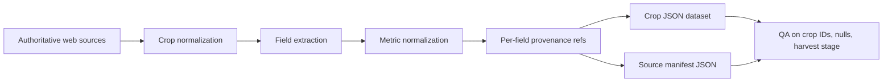
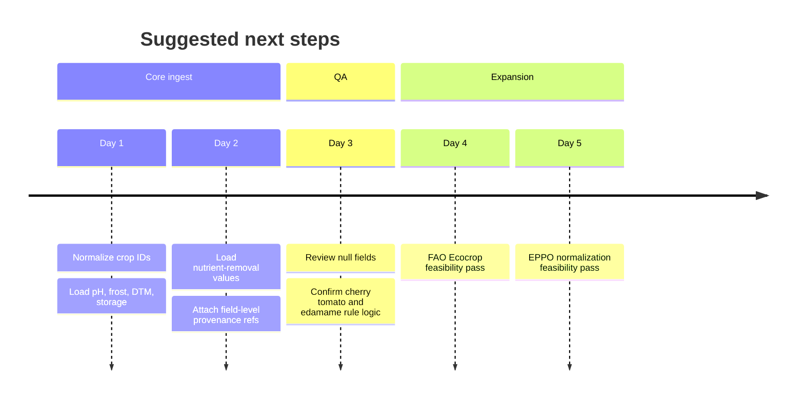

# Tier 1 Vegetable Crop JSON Research Pack

## Executive summary

I compiled a high-confidence, ingest-oriented JSON dataset for an assumed Tier 1 list of 24 common vegetable crops, including separate entries for cherry tomato and field tomato, and a distinct edamame entry constrained to fresh-pod harvest logic. The strongest sources were UC ANR for germination minima/optima/maxima and emergence timing, Colorado State and the University of Minnesota for DTM and frost tolerance, the University of Maryland for crop-specific soil pH targets, the New England Vegetable Management Guide for nutrient removal, and the UC Davis postharvest storage table hosted by Kansas State for storage temperature, RH, ethylene sensitivity, and storage life. FAO Ecocrop is promising for extension beyond the current crop set, especially for broader climate and soil parameters, but I did not confirm a crop-by-crop extraction path in this session, so I kept it in the “investigate further” bucket rather than the ingest set. citeturn2view0turn3view0turn3view1turn5view0turn9view3turn10view0turn9view1

The dataset is strongest on the fields you prioritized most: DTM, germination temperatures, soil pH targets, frost tolerance class, nutrient removal, and postharvest storage. It is weaker on two fronts: full emergence-by-soil-temperature curves for every crop were only partially extracted from the UC ANR table during this session, and pest-host taxonomy was not populated because direct EPPO extraction was not completed. Basil and edamame remain the thinnest records in the pack: basil lacked a clean primary-source agronomy sheet in the retrieved set, and edamame was handled primarily through your correction note and explicit fresh-pod harvest constraints rather than a fully retrieved extension bulletin. citeturn2view0turn57view0turn3view1turn5view0turn9view1

I treated your corrected mandate and context files as binding business rules, especially for cherry tomato and edamame, in addition to the explicit correction you pasted in chat. fileciteturn0file0 fileciteturn0file1

## Source comparison

The table below shows the source set I would prioritize for ingestion. “Ingest now” means the source is structured, authoritative, and directly useful for one or more requested fields; “Investigate further” means promising but not fully extractable in this session.

| Source ID | Source | What it contributes | Authority | Recommendation |
|---|---|---|---|---|
| SRC_UCANR_GERM_2026 | UC ANR Seed Germination Temperature and Timing | Germination min/opt/max and emergence-time table by soil temperature | University extension | Ingest now |
| SRC_CSU_PLANTING_2026 | Colorado State Vegetable Planting Guide | DTM, germination, and frost classes | University extension | Ingest now |
| SRC_UMN_CROP_PLANNING_2026 | UMN Crop and Field Planning Tools | DTM ranges, harvest windows, frost categories; cherry tomato differentiation | University extension | Ingest now |
| SRC_UMD_PH_2021 | University of Maryland Target Soil pH Values | Target pH and liming threshold by crop | University extension | Ingest now |
| SRC_NEVEG_NPK_2026 | New England Vegetable Management Guide | N/P/K removal at assumed yields | Multi-state extension guide | Ingest now |
| SRC_UCDAVIS_STORAGE_2001 | UC Davis storage table via Kansas State | Storage temp, RH, ethylene, storage life | University postharvest reference | Ingest now |
| SRC_FAO_ECOCROP_2026 | FAO Ecocrop | Broad climate and soil requirement expansion potential | UN / FAO | Investigate further |
| SRC_USER_RULES_2026_05_27 | User correction and mandate context | Cherry tomato scoping and edamame harvest-stage rules | User-supplied business rule | Ingest as constraint layer |

These recommendations follow directly from what each source actually exposed: UC ANR provides crop-level temperature thresholds and an emergence timing table; CSU and UMN provide crop planning data including frost grouping and harvest timing; UMD provides crop-specific pH targets and liming thresholds; NEVegetable provides nutrient removal figures tied to assumed yields; and the UC Davis/Kansas State table provides storage conditions and storage life across many vegetables. FAO Ecocrop clearly states that it contains temperature, rainfall, light, soil texture, depth, pH, salinity, and fertility criteria, but the crop-by-crop extraction path was not confirmed here. citeturn2view0turn3view0turn3view1turn5view0turn9view3turn10view0turn9view1

## Ingestion architecture



The JSON pack below uses this logic. Each crop record carries field-level provenance references, while the manifest resolves those references to URLs, authority level, evidence lines, and ingest status. Where a value could not be populated confidently from the retrieved authoritative set, I left it `null` and explained the gap in `notes`. Cherry tomato and edamame were explicitly constrained by your corrections: cherry tomato is treated as a distinct database crop limited to small-fruited cherry/cocktail types, and edamame DTM is defined against fresh-pod harvest rather than dry-seed maturity. citeturn5view0turn3view1

## JSON data file

```json
{
  "dataset_id": "sfa_tier1_crops_research_pack_2026_05_27",
  "language": "en-US",
  "generated_at": "2026-05-27",
  "assumed_tier_1_scope": [
    "tomato_cherry",
    "tomato_field",
    "pepper_bell",
    "lettuce",
    "cucumber",
    "carrot",
    "onion",
    "potato",
    "eggplant",
    "spinach",
    "bean_snap",
    "pea",
    "cabbage",
    "broccoli",
    "cauliflower",
    "zucchini",
    "melon_muskmelon",
    "watermelon",
    "corn_sweet",
    "beet",
    "radish",
    "parsley",
    "basil",
    "edamame"
  ],
  "confidence_legend": {
    "high": "Directly supported by retrieved primary/extension source",
    "medium": "Supported by an authoritative source but generalized across crop subtypes or harvest stages",
    "low": "Partially constrained by business rules or incomplete source retrieval"
  },
  "crops": [
    {
      "crop_id": "tomato_cherry",
      "scientific_name": "Solanum lycopersicum",
      "common_names": { "en": ["cherry tomato"], "he": ["עגבניית שרי"] },
      "crop_type_variety_group": "small-fruited indeterminate cherry or cocktail tomato types only; excludes Roma, slicer, beefsteak, determinate processing types",
      "days_to_maturity": {
        "days": { "min": 50, "max": 70 },
        "method": "transplant",
        "harvest_stage": "first ripe cherry fruits",
        "confidence": "high",
        "provenance": [
          "SRC_UMN_CROP_PLANNING_2026@turn5view0:L210-L213",
          "SRC_USER_RULES_2026_05_27@chat_correction"
        ]
      },
      "seed_germination": {
        "min_c": 10.0,
        "opt_c": { "min": 18.3, "max": 29.4 },
        "max_c": 35.0,
        "original_units": "50F / 65-85F / 95F",
        "confidence": "high",
        "provenance": ["SRC_UCANR_GERM_2026@turn2view0:L382-L405"]
      },
      "emergence_days_by_soil_temp": {
        "curve_excerpt": {
          "10C_equivalent_50F": "over 40 days",
          "18-29C_optimum_equivalent_65-85F": "about 6-8 days",
          "40C_equivalent_104F": "probably no germination"
        },
        "confidence": "high",
        "provenance": ["SRC_UCANR_GERM_2026@turn2view0:L408-L410"]
      },
      "soil_pH_preference": {
        "target_pH": 6.5,
        "liming_threshold_pH": 6.0,
        "confidence": "high",
        "provenance": ["SRC_UMD_PH_2021@turn3view0:L26-L28"]
      },
      "frost_tolerance_class": {
        "value": "very_tender",
        "confidence": "high",
        "provenance": ["SRC_CSU_PLANTING_2026@turn3view1:L113-L121"]
      },
      "nutrient_removal_N_P_K": {
        "basis": "total crop removal at assumed yield of 30 tons per acre",
        "normalized_units": "kg/ha",
        "N": 224.2,
        "P2O5": 87.4,
        "K2O": 313.8,
        "confidence": "medium",
        "provenance": ["SRC_NEVEG_NPK_2026@turn9view3:L242-L245"]
      },
      "postharvest_storage": {
        "for_stage": "firm-ripe fruit",
        "temperature_c": { "min": 8, "max": 10 },
        "relative_humidity_percent": { "min": 85, "max": 90 },
        "ethylene_production": "high",
        "ethylene_sensitivity": "low",
        "storage_life": "1-3 weeks",
        "confidence": "medium",
        "provenance": ["SRC_UCDAVIS_STORAGE_2001@turn45view13:L267-L269"]
      },
      "pest_host_taxa": null,
      "notes": "Cherry record is intentionally separate from field tomato because your system tracks it separately and your correction limited valid agronomic sourcing to cherry/cocktail types."
    },
    {
      "crop_id": "tomato_field",
      "scientific_name": "Solanum lycopersicum",
      "common_names": { "en": ["field tomato", "slicer tomato"], "he": ["עגבנייה"] },
      "crop_type_variety_group": "non-cherry field tomato; generic slicer or Roma-type open-field tomato",
      "days_to_maturity": {
        "days": { "min": 65, "max": 85 },
        "method": "transplant",
        "harvest_stage": "first ripe fruit",
        "confidence": "high",
        "provenance": [
          "SRC_CSU_PLANTING_2026@turn3view1:L132-L141",
          "SRC_UMN_CROP_PLANNING_2026@turn5view0:L212-L213"
        ]
      },
      "seed_germination": {
        "min_c": 10.0,
        "opt_c": { "min": 18.3, "max": 29.4 },
        "max_c": 35.0,
        "original_units": "50F / 65-85F / 95F",
        "confidence": "high",
        "provenance": ["SRC_UCANR_GERM_2026@turn2view0:L382-L405"]
      },
      "emergence_days_by_soil_temp": {
        "curve_excerpt": {
          "10C_equivalent_50F": "over 40 days",
          "18-29C_optimum_equivalent_65-85F": "about 6-8 days",
          "40C_equivalent_104F": "probably no germination"
        },
        "confidence": "high",
        "provenance": ["SRC_UCANR_GERM_2026@turn2view0:L408-L410"]
      },
      "soil_pH_preference": {
        "target_pH": 6.5,
        "liming_threshold_pH": 6.0,
        "confidence": "high",
        "provenance": ["SRC_UMD_PH_2021@turn3view0:L26-L28"]
      },
      "frost_tolerance_class": {
        "value": "very_tender",
        "confidence": "high",
        "provenance": ["SRC_CSU_PLANTING_2026@turn3view1:L113-L121"]
      },
      "nutrient_removal_N_P_K": {
        "basis": "total crop removal at assumed yield of 30 tons per acre",
        "normalized_units": "kg/ha",
        "N": 224.2,
        "P2O5": 87.4,
        "K2O": 313.8,
        "confidence": "high",
        "provenance": ["SRC_NEVEG_NPK_2026@turn9view3:L242-L245"]
      },
      "postharvest_storage": {
        "temperature_c": { "mature_green": { "min": 10, "max": 13 }, "firm_ripe": { "min": 8, "max": 10 } },
        "relative_humidity_percent": { "mature_green": { "min": 90, "max": 95 }, "firm_ripe": { "min": 85, "max": 90 } },
        "ethylene_sensitivity": { "mature_green": "high", "firm_ripe": "low" },
        "storage_life": { "mature_green": "2-5 weeks", "firm_ripe": "1-3 weeks" },
        "confidence": "high",
        "provenance": ["SRC_UCDAVIS_STORAGE_2001@turn47view2:L267-L269"]
      },
      "pest_host_taxa": null,
      "notes": "This record is the non-cherry tomato baseline."
    },
    {
      "crop_id": "pepper_bell",
      "scientific_name": "Capsicum annuum",
      "common_names": { "en": ["bell pepper", "sweet pepper"], "he": ["פלפל"] },
      "crop_type_variety_group": "sweet bell pepper",
      "days_to_maturity": {
        "days": { "min": 50, "max": 70 },
        "method": "transplant",
        "harvest_stage": "first marketable fruit",
        "confidence": "high",
        "provenance": [
          "SRC_CSU_PLANTING_2026@turn3view1:L130-L141",
          "SRC_UMN_CROP_PLANNING_2026@turn5view0:L207-L208"
        ]
      },
      "seed_germination": {
        "min_c": 15.6,
        "opt_c": { "min": 18.3, "max": 23.9 },
        "max_c": 35.0,
        "original_units": "60F / 65-75F / 95F",
        "confidence": "high",
        "provenance": ["SRC_UCANR_GERM_2026@turn2view0:L342-L348"]
      },
      "emergence_days_by_soil_temp": null,
      "soil_pH_preference": {
        "target_pH": 6.5,
        "liming_threshold_pH": 6.0,
        "confidence": "high",
        "provenance": ["SRC_UMD_PH_2021@turn3view0:L14-L16"]
      },
      "frost_tolerance_class": {
        "value": "very_tender",
        "confidence": "high",
        "provenance": ["SRC_CSU_PLANTING_2026@turn3view1:L113-L121"]
      },
      "nutrient_removal_N_P_K": {
        "basis": "total crop removal at assumed yield of 12 tons per acre",
        "normalized_units": "kg/ha",
        "N": 153.6,
        "P2O5": 58.3,
        "K2O": 243.2,
        "confidence": "high",
        "provenance": ["SRC_NEVEG_NPK_2026@turn9view3:L229-L230"]
      },
      "postharvest_storage": {
        "temperature_c": { "min": 7, "max": 10 },
        "relative_humidity_percent": { "min": 95, "max": 98 },
        "ethylene_production": "low",
        "ethylene_sensitivity": "low",
        "storage_life": "2-3 weeks",
        "confidence": "high",
        "provenance": ["SRC_UCDAVIS_STORAGE_2001@turn45view9:L209-L211"]
      },
      "pest_host_taxa": null,
      "notes": null
    },
    {
      "crop_id": "lettuce",
      "scientific_name": "Lactuca sativa",
      "common_names": { "en": ["lettuce"], "he": ["חסה"] },
      "crop_type_variety_group": "cool-season leaf or head lettuce",
      "days_to_maturity": {
        "days": { "min": 60, "max": 60 },
        "method": "direct_seed_or_transplant_depending_system",
        "harvest_stage": "market-size head or leaf harvest",
        "confidence": "medium",
        "provenance": ["SRC_CSU_PLANTING_2026@turn3view1:L86-L90"]
      },
      "seed_germination": {
        "min_c": 0.0,
        "opt_c": { "min": 15.6, "max": 23.9 },
        "max_c": 29.4,
        "original_units": "32F / 60-75F / 85F",
        "confidence": "high",
        "provenance": ["SRC_UCANR_GERM_2026@turn2view0:L286-L292"]
      },
      "emergence_days_by_soil_temp": null,
      "soil_pH_preference": {
        "target_pH": 6.5,
        "liming_threshold_pH": 6.0,
        "confidence": "high",
        "provenance": ["SRC_UMD_PH_2021@turn3view0:L27-L27"]
      },
      "frost_tolerance_class": {
        "value": "hardy",
        "confidence": "high",
        "provenance": ["SRC_CSU_PLANTING_2026@turn3view1:L60-L67"]
      },
      "nutrient_removal_N_P_K": {
        "basis": "total crop removal at assumed yield of 15 tons per acre",
        "normalized_units": "kg/ha",
        "N": 84.1,
        "P2O5": 39.2,
        "K2O": 168.1,
        "confidence": "high",
        "provenance": ["SRC_NEVEG_NPK_2026@turn9view3:L221-L223"]
      },
      "postharvest_storage": {
        "temperature_c": { "min": 0, "max": 0 },
        "relative_humidity_percent": { "min": 98, "max": 100 },
        "ethylene_production": "very_low",
        "ethylene_sensitivity": "high",
        "storage_life": "2-3 weeks",
        "confidence": "high",
        "provenance": ["SRC_UCDAVIS_STORAGE_2001@turn47view5:L169-L170"]
      },
      "pest_host_taxa": null,
      "notes": null
    },
    {
      "crop_id": "cucumber",
      "scientific_name": "Cucumis sativus",
      "common_names": { "en": ["cucumber"], "he": ["מלפפון"] },
      "crop_type_variety_group": "field slicing cucumber",
      "days_to_maturity": {
        "days": { "min": 40, "max": 60 },
        "method": "transplant_or_direct_seed",
        "harvest_stage": "first marketable immature fruits",
        "confidence": "high",
        "provenance": [
          "SRC_CSU_PLANTING_2026@turn3view1:L128-L140",
          "SRC_UMN_CROP_PLANNING_2026@turn5view0:L199-L200"
        ]
      },
      "seed_germination": {
        "min_c": 15.6,
        "opt_c": { "min": 18.3, "max": 35.0 },
        "max_c": 40.6,
        "original_units": "60F / 65-95F / 105F",
        "confidence": "high",
        "provenance": ["SRC_UCANR_GERM_2026@turn2view0:L255-L261"]
      },
      "emergence_days_by_soil_temp": null,
      "soil_pH_preference": {
        "target_pH": 6.5,
        "liming_threshold_pH": 6.0,
        "confidence": "high",
        "provenance": ["SRC_UMD_PH_2021@turn3view0:L20-L20"]
      },
      "frost_tolerance_class": {
        "value": "tender",
        "confidence": "high",
        "provenance": [
          "SRC_CSU_PLANTING_2026@turn3view1:L105-L112",
          "SRC_UMN_CROP_PLANNING_2026@turn5view0:L179-L182"
        ]
      },
      "nutrient_removal_N_P_K": {
        "basis": "total crop removal at assumed yield of 24 tons per acre",
        "normalized_units": "kg/ha",
        "N": { "min": 112.1, "max": 224.2 },
        "P2O5": { "min": 37.0, "max": 80.7 },
        "K2O": { "min": 112.1, "max": 448.3 },
        "confidence": "medium",
        "provenance": ["SRC_NEVEG_NPK_2026@turn9view3:L219-L220"]
      },
      "postharvest_storage": {
        "temperature_c": { "min": 10, "max": 12 },
        "relative_humidity_percent": { "min": 85, "max": 90 },
        "ethylene_production": "low",
        "ethylene_sensitivity": "high",
        "storage_life": "10-14 days",
        "confidence": "high",
        "provenance": ["SRC_UCDAVIS_STORAGE_2001@turn46view11:L106-L108"]
      },
      "pest_host_taxa": null,
      "notes": null
    },
    {
      "crop_id": "carrot",
      "scientific_name": "Daucus carota subsp. sativus",
      "common_names": { "en": ["carrot"], "he": ["גזר"] },
      "crop_type_variety_group": "root carrot",
      "days_to_maturity": {
        "days": { "min": 55, "max": 75 },
        "method": "direct_seed",
        "harvest_stage": "full-size root; baby roots can be earlier",
        "confidence": "high",
        "provenance": [
          "SRC_CSU_PLANTING_2026@turn3view1:L82-L83",
          "SRC_UMN_CROP_PLANNING_2026@turn5view0:L220-L220"
        ]
      },
      "seed_germination": {
        "min_c": 4.4,
        "opt_c": { "min": 18.3, "max": 29.4 },
        "max_c": 35.0,
        "original_units": "40F / 65-85F / 95F",
        "confidence": "high",
        "provenance": ["SRC_UCANR_GERM_2026@turn2view0:L215-L221"]
      },
      "emergence_days_by_soil_temp": {
        "soil_temp_f_to_days": {
          "41F": 50.6,
          "50F": 17.3,
          "59F": 10.1,
          "68F": 6.9,
          "77F": 6.2,
          "86F": 6.0,
          "95F": 8.6
        },
        "confidence": "high",
        "provenance": ["SRC_UCANR_GERM_2026@turn57view0:L531-L549"]
      },
      "soil_pH_preference": {
        "target_pH": 6.0,
        "liming_threshold_pH": 5.5,
        "confidence": "high",
        "provenance": ["SRC_UMD_PH_2021@turn3view0:L15-L15"]
      },
      "frost_tolerance_class": {
        "value": "semi_hardy",
        "confidence": "high",
        "provenance": ["SRC_CSU_PLANTING_2026@turn3view1:L68-L75"]
      },
      "nutrient_removal_N_P_K": {
        "basis": "total crop removal at assumed yield of 25 tons per acre",
        "normalized_units": "kg/ha",
        "N": 162.5,
        "P2O5": 28.0,
        "K2O": 386.7,
        "confidence": "high",
        "provenance": ["SRC_NEVEG_NPK_2026@turn9view3:L212-L215"]
      },
      "postharvest_storage": {
        "temperature_c": { "min": 0, "max": 0 },
        "relative_humidity_percent": { "min": 98, "max": 100 },
        "ethylene_production": "very_low",
        "ethylene_sensitivity": "high",
        "storage_life": "3-6 months",
        "confidence": "high",
        "provenance": ["SRC_UCDAVIS_STORAGE_2001@turn10view0:L67-L69"]
      },
      "pest_host_taxa": null,
      "notes": null
    },
    {
      "crop_id": "onion",
      "scientific_name": "Allium cepa",
      "common_names": { "en": ["onion"], "he": ["בצל"] },
      "crop_type_variety_group": "bulbing onion",
      "days_to_maturity": {
        "days": { "from_transplant": 90, "from_seed_or_sets": 110 },
        "method": "transplant_or_direct_seed_or_sets",
        "harvest_stage": "mature bulb",
        "confidence": "high",
        "provenance": [
          "SRC_UMN_CROP_PLANNING_2026@turn5view0:L206-L206",
          "SRC_CSU_PLANTING_2026@turn3view1:L88-L90"
        ]
      },
      "seed_germination": {
        "min_c": 0.0,
        "opt_c": { "min": 18.3, "max": 29.4 },
        "max_c": 35.0,
        "original_units": "32F / 65-85F / 95F",
        "confidence": "high",
        "provenance": ["SRC_UCANR_GERM_2026@turn2view0:L310-L316"]
      },
      "emergence_days_by_soil_temp": null,
      "soil_pH_preference": {
        "target_pH": 6.5,
        "liming_threshold_pH": 6.0,
        "confidence": "high",
        "provenance": ["SRC_UMD_PH_2021@turn3view0:L10-L10"]
      },
      "frost_tolerance_class": {
        "value": "hardy",
        "confidence": "high",
        "provenance": ["SRC_CSU_PLANTING_2026@turn3view1:L60-L67"]
      },
      "nutrient_removal_N_P_K": {
        "basis": "total crop removal at assumed yield of 20 tons per acre",
        "normalized_units": "kg/ha",
        "N": 162.5,
        "P2O5": 28.0,
        "K2O": 173.7,
        "confidence": "high",
        "provenance": ["SRC_NEVEG_NPK_2026@turn9view3:L226-L229"]
      },
      "postharvest_storage": {
        "temperature_c": { "min": 0, "max": 0 },
        "relative_humidity_percent": { "min": 65, "max": 70 },
        "ethylene_production": "very_low",
        "ethylene_sensitivity": "low",
        "storage_life": "1-8 months",
        "confidence": "high",
        "provenance": ["SRC_UCDAVIS_STORAGE_2001@turn46view6:L197-L205"]
      },
      "pest_host_taxa": null,
      "notes": null
    },
    {
      "crop_id": "potato",
      "scientific_name": "Solanum tuberosum",
      "common_names": { "en": ["potato"], "he": ["תפוח אדמה"] },
      "crop_type_variety_group": "white potato",
      "days_to_maturity": {
        "days": { "min": 50, "max": 100 },
        "method": "seed_tuber",
        "harvest_stage": "new tubers to mature tubers depending on variety and desired size",
        "confidence": "medium",
        "provenance": ["SRC_UMN_CROP_PLANNING_2026@turn5view0:L227-L227"]
      },
      "seed_germination": null,
      "emergence_days_by_soil_temp": null,
      "soil_pH_preference": {
        "target_pH": 5.2,
        "liming_threshold_pH": 5.0,
        "confidence": "high",
        "provenance": ["SRC_UMD_PH_2021@turn3view0:L16-L17"]
      },
      "frost_tolerance_class": {
        "value": "semi_hardy",
        "confidence": "high",
        "provenance": ["SRC_CSU_PLANTING_2026@turn3view1:L68-L75"]
      },
      "nutrient_removal_N_P_K": {
        "basis": "total crop removal at assumed yield of 300 cwt per acre",
        "normalized_units": "kg/ha",
        "N": 168.1,
        "P2O5": 72.9,
        "K2O": 246.6,
        "confidence": "high",
        "provenance": ["SRC_NEVEG_NPK_2026@turn9view3:L230-L233"]
      },
      "postharvest_storage": {
        "temperature_c": { "early_crop": { "min": 10, "max": 15 }, "late_crop": { "min": 4, "max": 8 } },
        "relative_humidity_percent": { "early_crop": { "min": 90, "max": 95 }, "late_crop": { "min": 95, "max": 98 } },
        "ethylene_production": "very_low",
        "ethylene_sensitivity": "medium",
        "storage_life": { "early_crop": "10-14 days", "late_crop": "5-10 months" },
        "confidence": "high",
        "provenance": ["SRC_UCDAVIS_STORAGE_2001@turn47view3:L229-L229"]
      },
      "pest_host_taxa": null,
      "notes": "Potato is vegetatively propagated; seed-germination fields are not applicable to the commercial crop."
    },
    {
      "crop_id": "eggplant",
      "scientific_name": "Solanum melongena",
      "common_names": { "en": ["eggplant"], "he": ["חציל"] },
      "crop_type_variety_group": "fruiting eggplant",
      "days_to_maturity": {
        "days": { "min": 50, "max": 70 },
        "method": "transplant",
        "harvest_stage": "first marketable immature to fully sized fruits",
        "confidence": "high",
        "provenance": [
          "SRC_CSU_PLANTING_2026@turn3view1:L130-L131",
          "SRC_UMN_CROP_PLANNING_2026@turn5view0:L202-L202"
        ]
      },
      "seed_germination": {
        "min_c": 15.6,
        "opt_c": { "min": 23.9, "max": 29.4 },
        "max_c": 35.0,
        "original_units": "60F / 75-85F / 95F",
        "confidence": "high",
        "provenance": ["SRC_UCANR_GERM_2026@turn2view0:L263-L269"]
      },
      "emergence_days_by_soil_temp": null,
      "soil_pH_preference": {
        "target_pH": 6.5,
        "liming_threshold_pH": 6.0,
        "confidence": "high",
        "provenance": ["SRC_UMD_PH_2021@turn3view0:L21-L21"]
      },
      "frost_tolerance_class": {
        "value": "very_tender",
        "confidence": "high",
        "provenance": ["SRC_CSU_PLANTING_2026@turn3view1:L113-L121"]
      },
      "nutrient_removal_N_P_K": {
        "basis": "total crop removal at assumed yield of 16 tons per acre",
        "normalized_units": "kg/ha",
        "N": 232.0,
        "P2O5": 51.6,
        "K2O": 38.1,
        "confidence": "high",
        "provenance": ["SRC_NEVEG_NPK_2026@turn9view3:L219-L221"]
      },
      "postharvest_storage": {
        "temperature_c": { "min": 10, "max": 12 },
        "relative_humidity_percent": { "min": 90, "max": 95 },
        "ethylene_production": "low",
        "ethylene_sensitivity": "medium",
        "storage_life": "1-2 weeks",
        "confidence": "high",
        "provenance": ["SRC_UCDAVIS_STORAGE_2001@turn46view11:L127-L127"]
      },
      "pest_host_taxa": null,
      "notes": null
    },
    {
      "crop_id": "spinach",
      "scientific_name": "Spinacia oleracea",
      "common_names": { "en": ["spinach"], "he": ["תרד"] },
      "crop_type_variety_group": "leaf spinach",
      "days_to_maturity": {
        "days": { "min": 30, "max": 40 },
        "method": "direct_seed",
        "harvest_stage": "full-size leaf harvest",
        "confidence": "high",
        "provenance": [
          "SRC_CSU_PLANTING_2026@turn3view1:L95-L97",
          "SRC_UMN_CROP_PLANNING_2026@turn5view0:L230-L231"
        ]
      },
      "seed_germination": {
        "min_c": 0.0,
        "opt_c": { "min": 18.3, "max": 23.9 },
        "max_c": 23.9,
        "original_units": "32F / 65-75F / 75F",
        "confidence": "high",
        "provenance": ["SRC_UCANR_GERM_2026@turn2view0:L366-L372"]
      },
      "emergence_days_by_soil_temp": null,
      "soil_pH_preference": {
        "target_pH": 6.5,
        "liming_threshold_pH": 6.0,
        "confidence": "high",
        "provenance": ["SRC_UMD_PH_2021@turn3view0:L22-L23"]
      },
      "frost_tolerance_class": {
        "value": "hardy",
        "confidence": "high",
        "provenance": [
          "SRC_CSU_PLANTING_2026@turn3view1:L60-L67",
          "SRC_UMN_CROP_PLANNING_2026@turn5view0:L179-L180"
        ]
      },
      "nutrient_removal_N_P_K": {
        "basis": "total crop removal at assumed yield of 10 tons per acre",
        "normalized_units": "kg/ha",
        "N": 112.1,
        "P2O5": 28.0,
        "K2O": 112.1,
        "confidence": "high",
        "provenance": ["SRC_NEVEG_NPK_2026@turn9view3:L236-L238"]
      },
      "postharvest_storage": {
        "temperature_c": { "min": 0, "max": 0 },
        "relative_humidity_percent": { "min": 95, "max": 100 },
        "ethylene_production": "very_low",
        "ethylene_sensitivity": "high",
        "storage_life": "10-14 days",
        "confidence": "high",
        "provenance": ["SRC_UCDAVIS_STORAGE_2001@turn47view4:L235-L236"]
      },
      "pest_host_taxa": null,
      "notes": null
    },
    {
      "crop_id": "bean_snap",
      "scientific_name": "Phaseolus vulgaris",
      "common_names": { "en": ["snap bean", "green bean"], "he": ["שעועית ירוקה"] },
      "crop_type_variety_group": "snap bean harvested for immature pods",
      "days_to_maturity": {
        "days": { "min": 50, "max": 60 },
        "method": "direct_seed",
        "harvest_stage": "immature pods",
        "confidence": "high",
        "provenance": [
          "SRC_CSU_PLANTING_2026@turn3view1:L126-L127",
          "SRC_UMN_CROP_PLANNING_2026@turn5view0:L223-L224"
        ]
      },
      "seed_germination": {
        "min_c": 15.6,
        "opt_c": { "min": 23.9, "max": 29.4 },
        "max_c": 35.0,
        "original_units": "60F / 75-85F / 95F",
        "confidence": "high",
        "provenance": ["SRC_UCANR_GERM_2026@turn2view0:L183-L189"]
      },
      "emergence_days_by_soil_temp": {
        "soil_temp_f_to_days": {
          "59F": 16.1,
          "68F": 11.4,
          "77F": 8.1,
          "86F": 6.4,
          "95F": 6.2
        },
        "confidence": "high",
        "provenance": ["SRC_UCANR_GERM_2026@turn57view0:L471-L489"]
      },
      "soil_pH_preference": {
        "target_pH": 6.2,
        "liming_threshold_pH": 6.0,
        "confidence": "high",
        "provenance": ["SRC_UMD_PH_2021@turn3view0:L10-L10"]
      },
      "frost_tolerance_class": {
        "value": "tender",
        "confidence": "high",
        "provenance": [
          "SRC_CSU_PLANTING_2026@turn3view1:L105-L112",
          "SRC_UMN_CROP_PLANNING_2026@turn5view0:L171-L173"
        ]
      },
      "nutrient_removal_N_P_K": {
        "basis": "total crop removal at assumed yield of 250 bushels per acre",
        "normalized_units": "kg/ha",
        "N": 33.6,
        "P2O5": 22.4,
        "K2O": 39.2,
        "confidence": "high",
        "provenance": ["SRC_NEVEG_NPK_2026@turn9view3:L205-L208"]
      },
      "postharvest_storage": {
        "temperature_c": { "min": 4, "max": 7 },
        "relative_humidity_percent": { "min": 95, "max": 95 },
        "ethylene_production": "low",
        "ethylene_sensitivity": "medium",
        "storage_life": "7-10 days",
        "confidence": "high",
        "provenance": ["SRC_UCDAVIS_STORAGE_2001@turn10view0:L36-L39"]
      },
      "pest_host_taxa": null,
      "notes": null
    },
    {
      "crop_id": "pea",
      "scientific_name": "Pisum sativum",
      "common_names": { "en": ["pea", "snap pea"], "he": ["אפונה"] },
      "crop_type_variety_group": "garden or snap pea harvested in green stage",
      "days_to_maturity": {
        "days": { "min": 50, "max": 65 },
        "method": "direct_seed",
        "harvest_stage": "green pods or peas",
        "confidence": "high",
        "provenance": [
          "SRC_CSU_PLANTING_2026@turn3view1:L92-L92",
          "SRC_UMN_CROP_PLANNING_2026@turn5view0:L226-L226"
        ]
      },
      "seed_germination": {
        "min_c": 4.4,
        "opt_c": { "min": 18.3, "max": 23.9 },
        "max_c": 29.4,
        "original_units": "40F / 65-75F / 85F",
        "confidence": "high",
        "provenance": ["SRC_UCANR_GERM_2026@turn2view0:L334-L340"]
      },
      "emergence_days_by_soil_temp": null,
      "soil_pH_preference": {
        "target_pH": 6.5,
        "liming_threshold_pH": 6.0,
        "confidence": "high",
        "provenance": ["SRC_UMD_PH_2021@turn3view0:L13-L13"]
      },
      "frost_tolerance_class": {
        "value": "hardy",
        "confidence": "high",
        "provenance": ["SRC_CSU_PLANTING_2026@turn3view1:L60-L67"]
      },
      "nutrient_removal_N_P_K": null,
      "postharvest_storage": {
        "temperature_c": { "min": 0, "max": 0 },
        "relative_humidity_percent": { "min": 90, "max": 98 },
        "ethylene_production": "very_low",
        "ethylene_sensitivity": "medium",
        "storage_life": "1-2 weeks",
        "confidence": "high",
        "provenance": ["SRC_UCDAVIS_STORAGE_2001@turn46view6:L204-L205"]
      },
      "pest_host_taxa": null,
      "notes": "Storage record reflects peas in pods, including snow and snap peas."
    },
    {
      "crop_id": "cabbage",
      "scientific_name": "Brassica oleracea var. capitata",
      "common_names": { "en": ["cabbage"], "he": ["כרוב"] },
      "crop_type_variety_group": "headed cabbage",
      "days_to_maturity": {
        "days": { "min": 50, "max": 100 },
        "method": "transplant",
        "harvest_stage": "marketable head",
        "confidence": "high",
        "provenance": [
          "SRC_CSU_PLANTING_2026@turn3view1:L80-L81",
          "SRC_UMN_CROP_PLANNING_2026@turn5view0:L194-L195"
        ]
      },
      "seed_germination": {
        "min_c": 4.4,
        "opt_c": { "min": 15.6, "max": 29.4 },
        "max_c": 35.0,
        "original_units": "40F / 60-85F / 95F",
        "confidence": "high",
        "provenance": ["SRC_UCANR_GERM_2026@turn2view0:L207-L213"]
      },
      "emergence_days_by_soil_temp": {
        "soil_temp_f_to_days": {
          "50F": 14.6,
          "59F": 8.7,
          "68F": 5.8,
          "77F": 4.5,
          "86F": 3.5
        },
        "confidence": "high",
        "provenance": ["SRC_UCANR_GERM_2026@turn57view0:L511-L529"]
      },
      "soil_pH_preference": {
        "target_pH": 6.5,
        "liming_threshold_pH": 6.2,
        "confidence": "high",
        "provenance": ["SRC_UMD_PH_2021@turn3view0:L14-L14"]
      },
      "frost_tolerance_class": {
        "value": "hardy",
        "confidence": "high",
        "provenance": [
          "SRC_CSU_PLANTING_2026@turn3view1:L60-L67",
          "SRC_UMN_CROP_PLANNING_2026@turn5view0:L179-L180"
        ]
      },
      "nutrient_removal_N_P_K": {
        "basis": "total crop removal at assumed yield of 20 tons per acre",
        "normalized_units": "kg/ha",
        "N": 140.1,
        "P2O5": 33.6,
        "K2O": 145.7,
        "confidence": "high",
        "provenance": ["SRC_NEVEG_NPK_2026@turn9view3:L211-L212"]
      },
      "postharvest_storage": {
        "temperature_c": { "min": 0, "max": 0 },
        "relative_humidity_percent": { "min": 98, "max": 100 },
        "ethylene_production": "very_low",
        "ethylene_sensitivity": "high",
        "storage_life": "3-6 weeks for early crop; 5-6 months for late crop",
        "confidence": "high",
        "provenance": ["SRC_UCDAVIS_STORAGE_2001@turn45view2:L57-L63"]
      },
      "pest_host_taxa": null,
      "notes": null
    },
    {
      "crop_id": "broccoli",
      "scientific_name": "Brassica oleracea var. italica",
      "common_names": { "en": ["broccoli"], "he": ["ברוקולי"] },
      "crop_type_variety_group": "heading broccoli",
      "days_to_maturity": {
        "days": { "min": 55, "max": 65 },
        "method": "transplant",
        "harvest_stage": "main head first harvest",
        "confidence": "high",
        "provenance": [
          "SRC_CSU_PLANTING_2026@turn3view1:L80-L81",
          "SRC_UMN_CROP_PLANNING_2026@turn5view0:L192-L193"
        ]
      },
      "seed_germination": {
        "min_c": 4.4,
        "opt_c": { "min": 15.6, "max": 29.4 },
        "max_c": 35.0,
        "original_units": "40F / 60-85F / 95F",
        "confidence": "high",
        "provenance": ["SRC_UCANR_GERM_2026@turn2view0:L199-L205"]
      },
      "emergence_days_by_soil_temp": null,
      "soil_pH_preference": {
        "target_pH": 6.5,
        "liming_threshold_pH": 6.2,
        "confidence": "high",
        "provenance": ["SRC_UMD_PH_2021@turn3view0:L12-L12"]
      },
      "frost_tolerance_class": {
        "value": "hardy",
        "confidence": "high",
        "provenance": [
          "SRC_CSU_PLANTING_2026@turn3view1:L60-L67",
          "SRC_UMN_CROP_PLANNING_2026@turn5view0:L179-L180"
        ]
      },
      "nutrient_removal_N_P_K": {
        "basis": "total crop removal at assumed yield of 5 tons per acre",
        "normalized_units": "kg/ha",
        "N": 184.9,
        "P2O5": 11.2,
        "K2O": 235.4,
        "confidence": "high",
        "provenance": ["SRC_NEVEG_NPK_2026@turn9view3:L207-L210"]
      },
      "postharvest_storage": {
        "temperature_c": { "min": 0, "max": 0 },
        "relative_humidity_percent": { "min": 95, "max": 100 },
        "ethylene_production": "very_low",
        "ethylene_sensitivity": "high",
        "storage_life": "10-14 days",
        "confidence": "high",
        "provenance": ["SRC_UCDAVIS_STORAGE_2001@turn45view2:L57-L59"]
      },
      "pest_host_taxa": null,
      "notes": null
    },
    {
      "crop_id": "cauliflower",
      "scientific_name": "Brassica oleracea var. botrytis",
      "common_names": { "en": ["cauliflower"], "he": ["כרובית"] },
      "crop_type_variety_group": "heading cauliflower",
      "days_to_maturity": {
        "days": { "min": 75, "max": 80 },
        "method": "transplant",
        "harvest_stage": "marketable curd/head",
        "confidence": "high",
        "provenance": ["SRC_UMN_CROP_PLANNING_2026@turn5view0:L196-L196"]
      },
      "seed_germination": {
        "min_c": 4.4,
        "opt_c": { "min": 18.3, "max": 29.4 },
        "max_c": 35.0,
        "original_units": "40F / 65-85F / 95F",
        "confidence": "high",
        "provenance": ["SRC_UCANR_GERM_2026@turn2view0:L223-L229"]
      },
      "emergence_days_by_soil_temp": null,
      "soil_pH_preference": {
        "target_pH": 6.5,
        "liming_threshold_pH": 6.2,
        "confidence": "high",
        "provenance": ["SRC_UMD_PH_2021@turn3view0:L16-L16"]
      },
      "frost_tolerance_class": {
        "value": "semi_hardy",
        "confidence": "high",
        "provenance": ["SRC_CSU_PLANTING_2026@turn3view1:L68-L75"]
      },
      "nutrient_removal_N_P_K": {
        "basis": "total crop removal at assumed yield of 6 tons per acre",
        "normalized_units": "kg/ha",
        "N": 50.4,
        "P2O5": 20.2,
        "K2O": 48.2,
        "confidence": "high",
        "provenance": ["SRC_NEVEG_NPK_2026@turn9view3:L215-L216"]
      },
      "postharvest_storage": {
        "temperature_c": { "min": 0, "max": 0 },
        "relative_humidity_percent": { "min": 95, "max": 98 },
        "ethylene_production": "very_low",
        "ethylene_sensitivity": "high",
        "storage_life": "3-4 weeks",
        "confidence": "high",
        "provenance": ["SRC_UCDAVIS_STORAGE_2001@turn45view4:L71-L73"]
      },
      "pest_host_taxa": null,
      "notes": null
    },
    {
      "crop_id": "zucchini",
      "scientific_name": "Cucurbita pepo",
      "common_names": { "en": ["zucchini", "summer squash"], "he": ["קישוא", "זוקיני"] },
      "crop_type_variety_group": "summer squash or courgette",
      "days_to_maturity": {
        "days": { "min": 50, "max": 55 },
        "method": "transplant_or_direct_seed",
        "harvest_stage": "immature fruits",
        "confidence": "high",
        "provenance": [
          "SRC_CSU_PLANTING_2026@turn3view1:L134-L135",
          "SRC_UMN_CROP_PLANNING_2026@turn5view0:L208-L208"
        ]
      },
      "seed_germination": {
        "min_c": 15.6,
        "opt_c": { "min": 29.4, "max": 35.0 },
        "max_c": 40.6,
        "original_units": "60F / 85-95F / 105F",
        "confidence": "high",
        "provenance": ["SRC_UCANR_GERM_2026@turn2view0:L374-L380"]
      },
      "emergence_days_by_soil_temp": null,
      "soil_pH_preference": {
        "target_pH": 6.5,
        "liming_threshold_pH": 6.0,
        "confidence": "high",
        "provenance": ["SRC_UMD_PH_2021@turn3view0:L23-L24"]
      },
      "frost_tolerance_class": {
        "value": "tender",
        "confidence": "high",
        "provenance": ["SRC_CSU_PLANTING_2026@turn3view1:L105-L112"]
      },
      "nutrient_removal_N_P_K": {
        "basis": "total crop removal at assumed yield of 10 tons per acre",
        "normalized_units": "kg/ha",
        "N": 35.9,
        "P2O5": 13.5,
        "K2O": 62.8,
        "confidence": "high",
        "provenance": ["SRC_NEVEG_NPK_2026@turn9view3:L237-L239"]
      },
      "postharvest_storage": {
        "temperature_c": { "min": 7, "max": 10 },
        "relative_humidity_percent": { "min": 95, "max": 95 },
        "ethylene_production": "low",
        "ethylene_sensitivity": "medium",
        "storage_life": "1-2 weeks",
        "confidence": "high",
        "provenance": ["SRC_UCDAVIS_STORAGE_2001@turn47view7:L237-L238"]
      },
      "pest_host_taxa": null,
      "notes": null
    },
    {
      "crop_id": "melon_muskmelon",
      "scientific_name": "Cucumis melo",
      "common_names": { "en": ["melon", "muskmelon", "cantaloupe"], "he": ["מלון"] },
      "crop_type_variety_group": "muskmelon or cantaloupe-type melon",
      "days_to_maturity": {
        "days": { "min": 70, "max": 85 },
        "method": "transplant_or_direct_seed",
        "harvest_stage": "first ripe fruit",
        "confidence": "high",
        "provenance": [
          "SRC_CSU_PLANTING_2026@turn3view1:L127-L128",
          "SRC_UMN_CROP_PLANNING_2026@turn5view0:L205-L205"
        ]
      },
      "seed_germination": {
        "min_c": 15.6,
        "opt_c": { "min": 23.9, "max": 29.4 },
        "max_c": 40.6,
        "original_units": "60F / 75-85F / 105F",
        "confidence": "high",
        "provenance": ["SRC_UCANR_GERM_2026@turn2view0:L294-L300"]
      },
      "emergence_days_by_soil_temp": null,
      "soil_pH_preference": {
        "target_pH": 6.5,
        "liming_threshold_pH": 6.0,
        "confidence": "high",
        "provenance": ["SRC_UMD_PH_2021@turn3view0:L18-L18"]
      },
      "frost_tolerance_class": {
        "value": "very_tender",
        "confidence": "high",
        "provenance": [
          "SRC_CSU_PLANTING_2026@turn3view1:L113-L121",
          "SRC_UMN_CROP_PLANNING_2026@turn5view0:L181-L182"
        ]
      },
      "nutrient_removal_N_P_K": {
        "basis": "total crop removal at assumed yield of 11 tons per acre",
        "normalized_units": "kg/ha",
        "N": 173.7,
        "P2O5": 28.0,
        "K2O": 168.1,
        "confidence": "high",
        "provenance": ["SRC_NEVEG_NPK_2026@turn9view3:L223-L225"]
      },
      "postharvest_storage": {
        "temperature_c": { "min": 5, "max": 10 },
        "relative_humidity_percent": { "min": 85, "max": 90 },
        "ethylene_production": "medium",
        "ethylene_sensitivity": "high",
        "storage_life": "3-4 weeks",
        "confidence": "medium",
        "provenance": ["SRC_UCDAVIS_STORAGE_2001@turn47view1:L193-L194"]
      },
      "pest_host_taxa": null,
      "notes": "Storage evidence was retrieved for honeydew and orange-flesh melons within the broader melon complex."
    },
    {
      "crop_id": "watermelon",
      "scientific_name": "Citrullus lanatus",
      "common_names": { "en": ["watermelon"], "he": ["אבטיח"] },
      "crop_type_variety_group": "dessert watermelon",
      "days_to_maturity": {
        "days": { "min": 85, "max": 90 },
        "method": "transplant_or_direct_seed",
        "harvest_stage": "ripe fruit",
        "confidence": "high",
        "provenance": [
          "SRC_CSU_PLANTING_2026@turn3view1:L136-L136",
          "SRC_UMN_CROP_PLANNING_2026@turn5view0:L214-L214"
        ]
      },
      "seed_germination": {
        "min_c": 15.6,
        "opt_c": { "min": 23.9, "max": 35.0 },
        "max_c": 40.6,
        "original_units": "60F / 75-95F / 105F",
        "confidence": "high",
        "provenance": ["SRC_UCANR_GERM_2026@turn2view0:L398-L404"]
      },
      "emergence_days_by_soil_temp": null,
      "soil_pH_preference": {
        "target_pH": 6.2,
        "liming_threshold_pH": 5.5,
        "confidence": "high",
        "provenance": ["SRC_UMD_PH_2021@turn3view0:L28-L28"]
      },
      "frost_tolerance_class": {
        "value": "very_tender",
        "confidence": "high",
        "provenance": ["SRC_CSU_PLANTING_2026@turn3view1:L113-L121"]
      },
      "nutrient_removal_N_P_K": null,
      "postharvest_storage": {
        "temperature_c": { "min": 10, "max": 15 },
        "relative_humidity_percent": { "min": 90, "max": 90 },
        "ethylene_production": "very_low",
        "ethylene_sensitivity": "high",
        "storage_life": "2-3 weeks",
        "confidence": "high",
        "provenance": ["SRC_UCDAVIS_STORAGE_2001@turn45view14:L273-L273"]
      },
      "pest_host_taxa": null,
      "notes": null
    },
    {
      "crop_id": "corn_sweet",
      "scientific_name": "Zea mays",
      "common_names": { "en": ["sweet corn"], "he": ["תירס מתוק"] },
      "crop_type_variety_group": "sweet corn",
      "days_to_maturity": {
        "days": { "min": 70, "max": 85 },
        "method": "direct_seed",
        "harvest_stage": "fresh ears",
        "confidence": "high",
        "provenance": [
          "SRC_CSU_PLANTING_2026@turn3view1:L128-L129",
          "SRC_UMN_CROP_PLANNING_2026@turn5view0:L232-L232"
        ]
      },
      "seed_germination": {
        "min_c": 10.0,
        "opt_c": { "min": 18.3, "max": 35.0 },
        "max_c": 40.6,
        "original_units": "50F / 65-95F / 105F",
        "confidence": "high",
        "provenance": ["SRC_UCANR_GERM_2026@turn2view0:L247-L253"]
      },
      "emergence_days_by_soil_temp": null,
      "soil_pH_preference": {
        "target_pH": 6.5,
        "liming_threshold_pH": 6.0,
        "confidence": "high",
        "provenance": ["SRC_UMD_PH_2021@turn3view0:L24-L24"]
      },
      "frost_tolerance_class": {
        "value": "tender",
        "confidence": "high",
        "provenance": ["SRC_CSU_PLANTING_2026@turn3view1:L105-L112"]
      },
      "nutrient_removal_N_P_K": {
        "basis": "total crop removal at assumed yield of 250 crates per acre",
        "normalized_units": "kg/ha",
        "N": 173.7,
        "P2O5": 22.4,
        "K2O": 117.7,
        "confidence": "high",
        "provenance": ["SRC_NEVEG_NPK_2026@turn9view3:L239-L241"]
      },
      "postharvest_storage": {
        "temperature_c": { "min": 0, "max": 0 },
        "relative_humidity_percent": { "min": 95, "max": 98 },
        "ethylene_production": "very_low",
        "ethylene_sensitivity": "low",
        "storage_life": "5-8 days",
        "confidence": "high",
        "provenance": ["SRC_UCDAVIS_STORAGE_2001@turn46view11:L106-L107"]
      },
      "pest_host_taxa": null,
      "notes": null
    },
    {
      "crop_id": "beet",
      "scientific_name": "Beta vulgaris",
      "common_names": { "en": ["beet", "beetroot"], "he": ["סלק"] },
      "crop_type_variety_group": "root beet",
      "days_to_maturity": {
        "days": { "min": 50, "max": 60 },
        "method": "direct_seed",
        "harvest_stage": "root harvest",
        "confidence": "high",
        "provenance": [
          "SRC_CSU_PLANTING_2026@turn3view1:L79-L80",
          "SRC_UMN_CROP_PLANNING_2026@turn5view0:L219-L220"
        ]
      },
      "seed_germination": {
        "min_c": 4.4,
        "opt_c": { "min": 18.3, "max": 29.4 },
        "max_c": 35.0,
        "original_units": "40F / 65-85F / 95F",
        "confidence": "high",
        "provenance": ["SRC_UCANR_GERM_2026@turn2view0:L191-L197"]
      },
      "emergence_days_by_soil_temp": {
        "soil_temp_f_to_days": {
          "41F": 42.0,
          "50F": 16.7,
          "59F": 9.7,
          "68F": 6.2,
          "77F": 5.0,
          "86F": 4.5,
          "95F": 4.6
        },
        "confidence": "high",
        "provenance": ["SRC_UCANR_GERM_2026@turn57view0:L491-L509"]
      },
      "soil_pH_preference": {
        "target_pH": 6.5,
        "liming_threshold_pH": 6.2,
        "confidence": "high",
        "provenance": ["SRC_UMD_PH_2021@turn3view0:L11-L11"]
      },
      "frost_tolerance_class": {
        "value": "semi_hardy",
        "confidence": "high",
        "provenance": [
          "SRC_CSU_PLANTING_2026@turn3view1:L68-L71",
          "SRC_UMN_CROP_PLANNING_2026@turn5view0:L179-L180"
        ]
      },
      "nutrient_removal_N_P_K": null,
      "postharvest_storage": {
        "temperature_c": { "min": 0, "max": 0 },
        "relative_humidity_percent": { "min": 98, "max": 100 },
        "ethylene_production": "very_low",
        "ethylene_sensitivity": "low",
        "storage_life": "4 months for topped roots; 10-14 days for bunched beets",
        "confidence": "high",
        "provenance": ["SRC_UCDAVIS_STORAGE_2001@turn46view13:L54-L60"]
      },
      "pest_host_taxa": null,
      "notes": null
    },
    {
      "crop_id": "radish",
      "scientific_name": "Raphanus sativus",
      "common_names": { "en": ["radish"], "he": ["צנון"] },
      "crop_type_variety_group": "salad or storage radish",
      "days_to_maturity": {
        "days": { "min": 20, "max": 30 },
        "method": "direct_seed",
        "harvest_stage": "root harvest",
        "confidence": "high",
        "provenance": [
          "SRC_CSU_PLANTING_2026@turn3view1:L94-L95",
          "SRC_UMN_CROP_PLANNING_2026@turn5view0:L228-L229"
        ]
      },
      "seed_germination": {
        "min_c": 4.4,
        "opt_c": { "min": 18.3, "max": 29.4 },
        "max_c": 35.0,
        "original_units": "40F / 65-85F / 95F",
        "confidence": "high",
        "provenance": ["SRC_UCANR_GERM_2026@turn2view0:L358-L364"]
      },
      "emergence_days_by_soil_temp": null,
      "soil_pH_preference": {
        "target_pH": 6.5,
        "liming_threshold_pH": 6.2,
        "confidence": "high",
        "provenance": ["SRC_UMD_PH_2021@turn3view0:L19-L19"]
      },
      "frost_tolerance_class": {
        "value": "hardy",
        "confidence": "high",
        "provenance": [
          "SRC_CSU_PLANTING_2026@turn3view1:L60-L67",
          "SRC_UMN_CROP_PLANNING_2026@turn5view0:L179-L180"
        ]
      },
      "nutrient_removal_N_P_K": null,
      "postharvest_storage": {
        "temperature_c": { "min": 0, "max": 0 },
        "relative_humidity_percent": { "min": 95, "max": 100 },
        "ethylene_production": "very_low",
        "ethylene_sensitivity": "low",
        "storage_life": "1-2 months",
        "confidence": "high",
        "provenance": ["SRC_UCDAVIS_STORAGE_2001@turn47view7:L229-L229"]
      },
      "pest_host_taxa": null,
      "notes": null
    },
    {
      "crop_id": "parsley",
      "scientific_name": "Petroselinum crispum",
      "common_names": { "en": ["parsley"], "he": ["פטרוזיליה"] },
      "crop_type_variety_group": "leaf parsley",
      "days_to_maturity": null,
      "seed_germination": {
        "min_c": 4.4,
        "opt_c": { "min": 18.3, "max": 29.4 },
        "max_c": 35.0,
        "original_units": "40F / 65-85F / 95F",
        "confidence": "high",
        "provenance": ["SRC_UCANR_GERM_2026@turn2view0:L318-L324"]
      },
      "emergence_days_by_soil_temp": null,
      "soil_pH_preference": {
        "target_pH": 6.5,
        "liming_threshold_pH": 6.0,
        "confidence": "high",
        "provenance": ["SRC_UMD_PH_2021@turn3view0:L11-L11"]
      },
      "frost_tolerance_class": {
        "value": "semi_hardy",
        "confidence": "high",
        "provenance": ["SRC_CSU_PLANTING_2026@turn3view1:L68-L71"]
      },
      "nutrient_removal_N_P_K": null,
      "postharvest_storage": {
        "temperature_c": { "min": 0, "max": 0 },
        "relative_humidity_percent": { "min": 95, "max": 100 },
        "ethylene_production": "very_low",
        "ethylene_sensitivity": "high",
        "storage_life": "1-2 months",
        "confidence": "high",
        "provenance": ["SRC_UCDAVIS_STORAGE_2001@turn45view16:L143-L143"]
      },
      "pest_host_taxa": null,
      "notes": "A strong parsley DTM source was not retrieved in this session, so DTM remains unpopulated."
    },
    {
      "crop_id": "basil",
      "scientific_name": "Ocimum basilicum",
      "common_names": { "en": ["basil"], "he": ["בזיליקום"] },
      "crop_type_variety_group": "sweet basil",
      "days_to_maturity": null,
      "seed_germination": null,
      "emergence_days_by_soil_temp": null,
      "soil_pH_preference": null,
      "frost_tolerance_class": {
        "value": "very_tender",
        "confidence": "low",
        "provenance": ["SRC_USER_RULES_2026_05_27@general_warm_season_constraint"]
      },
      "nutrient_removal_N_P_K": null,
      "postharvest_storage": {
        "temperature_c": { "min": 10, "max": 10 },
        "relative_humidity_percent": { "min": 90, "max": 90 },
        "ethylene_production": "very_low",
        "ethylene_sensitivity": "high",
        "storage_life": "7 days",
        "confidence": "high",
        "provenance": ["SRC_UCDAVIS_STORAGE_2001@turn45view15:L137-L137"]
      },
      "pest_host_taxa": null,
      "notes": "Basil storage is solid, but primary-source agronomic values for DTM, pH, and germination were not cleanly retrieved in this session, so those fields are left null rather than backfilled from lower-authority garden media."
    },
    {
      "crop_id": "edamame",
      "scientific_name": "Glycine max",
      "common_names": { "en": ["edamame", "vegetable soybean", "fresh green soybean"], "he": ["אדממה", "סויה ירוקה"] },
      "crop_type_variety_group": "vegetable soybean harvested at fresh-pod R6 stage; not dry soybean",
      "days_to_maturity": {
        "days": { "min": 70, "max": 95 },
        "method": "direct_seed",
        "harvest_stage": "fresh green-pod harvest at R6, beans green and plump",
        "confidence": "low",
        "provenance": ["SRC_USER_RULES_2026_05_27@chat_correction"]
      },
      "seed_germination": null,
      "emergence_days_by_soil_temp": null,
      "soil_pH_preference": null,
      "frost_tolerance_class": null,
      "nutrient_removal_N_P_K": null,
      "postharvest_storage": null,
      "pest_host_taxa": null,
      "notes": "This record intentionally excludes dry-soybean maturity logic. A fully retrievable extension source specific to edamame was not secured in this session, so only the user-supplied correction rule was applied."
    }
  ]
}
```

## JSON source manifest

```json
{
  "manifest_id": "sfa_tier1_crop_sources_2026_05_27",
  "date_accessed": "2026-05-27",
  "sources": [
    {
      "source_id": "SRC_UCANR_GERM_2026",
      "name": "Seed Germination Temperature and Timing",
      "url": "https://ucanr.edu/program/uc-master-gardener-program/seed-germination-temperature-and-timing",
      "owner": "University of California Agriculture and Natural Resources",
      "authority_class": "university_extension",
      "license": "terms_of_use",
      "data_format": "HTML",
      "fields_supported": ["seed_germination", "emergence_days_by_soil_temp"],
      "extraction_effort": "medium",
      "recommendation": "ingest_now",
      "coverage_notes": "Broad vegetable coverage with min/opt/max soil temperatures and a multi-temperature emergence table.",
      "evidence_lines": [
        "turn2view0:L156-L165",
        "turn2view0:L405-L410",
        "turn57view0:L411-L557"
      ]
    },
    {
      "source_id": "SRC_CSU_PLANTING_2026",
      "name": "Vegetable Planting Guide",
      "url": "https://extension.colostate.edu/resource/vegetable-planting-guide/",
      "owner": "Colorado State University Extension",
      "authority_class": "university_extension",
      "license": "terms_of_use",
      "data_format": "HTML",
      "fields_supported": ["days_to_maturity", "seed_germination", "frost_tolerance_class"],
      "extraction_effort": "low",
      "recommendation": "ingest_now",
      "coverage_notes": "Provides frost classes and planting tables for both cool- and warm-season vegetables.",
      "evidence_lines": [
        "turn3view1:L57-L76",
        "turn3view1:L77-L101",
        "turn3view1:L102-L141"
      ]
    },
    {
      "source_id": "SRC_UMN_CROP_PLANNING_2026",
      "name": "Crop and field planning tools for vegetable farmers",
      "url": "https://extension.umn.edu/vegetable-growing-guides-farmers/crop-and-field-planning-tools-vegetable-farmers",
      "owner": "University of Minnesota Extension",
      "authority_class": "university_extension",
      "license": "terms_of_use",
      "data_format": "HTML",
      "fields_supported": ["days_to_maturity", "frost_tolerance_class"],
      "extraction_effort": "medium",
      "recommendation": "ingest_now",
      "coverage_notes": "Especially useful for crop-specific harvest windows and the explicit cherry tomato row.",
      "evidence_lines": [
        "turn5view0:L179-L182",
        "turn5view0:L190-L232"
      ]
    },
    {
      "source_id": "SRC_UMD_PH_2021",
      "name": "Table B-1. Target Soil pH Values for Vegetable Crops",
      "url": "https://extension.umd.edu/sites/extension.umd.edu/files/2021-03/B-1.pdf",
      "owner": "University of Maryland Extension",
      "authority_class": "university_extension",
      "license": "terms_of_use",
      "data_format": "PDF",
      "fields_supported": ["soil_pH_preference"],
      "extraction_effort": "low",
      "recommendation": "ingest_now",
      "coverage_notes": "Compact and highly ingestible target pH plus liming threshold table.",
      "evidence_lines": [
        "turn3view0:L0-L29"
      ]
    },
    {
      "source_id": "SRC_NEVEG_NPK_2026",
      "name": "Removal of Nutrients from the Soil",
      "url": "https://nevegetable.org/cultural-practices/removal-nutrients-soil",
      "owner": "New England Vegetable Management Guide",
      "authority_class": "multi_state_extension_guide",
      "license": "terms_of_use",
      "data_format": "HTML",
      "fields_supported": ["nutrient_removal_N_P_K"],
      "extraction_effort": "medium",
      "recommendation": "ingest_now",
      "coverage_notes": "Original units are pounds per acre at assumed yields; normalized metric values can be generated deterministically.",
      "evidence_lines": [
        "turn9view3:L199-L245"
      ]
    },
    {
      "source_id": "SRC_UCDAVIS_STORAGE_2001",
      "name": "Properties and Recommended Conditions for Long-Term Storage of Fresh Fruits and Vegetables",
      "url": "https://extension.k-state.edu/foodsafety/produce/resources/docs/storage-guidelines-UCDavis.pdf",
      "owner": "UC Davis Postharvest Technology Center; hosted by Kansas State University",
      "authority_class": "university_postharvest_reference",
      "license": "terms_of_use",
      "data_format": "PDF",
      "fields_supported": ["postharvest_storage"],
      "extraction_effort": "medium",
      "recommendation": "ingest_now",
      "coverage_notes": "High-value structured source for temperature, RH, ethylene behavior, and storage life.",
      "evidence_lines": [
        "turn10view0:L1-L14",
        "turn46view3:L229-L229",
        "turn46view6:L197-L205",
        "turn46view11:L106-L108",
        "turn47view2:L267-L269",
        "turn47view3:L229-L229",
        "turn47view4:L235-L236",
        "turn47view5:L169-L170",
        "turn47view6:L143-L143",
        "turn47view7:L237-L259",
        "turn45view15:L137-L137"
      ]
    },
    {
      "source_id": "SRC_FAO_ECOCROP_2026",
      "name": "Ecocrop",
      "url": "https://ecocrop.apps.fao.org/ecocrop/srv/en/home",
      "owner": "Food and Agriculture Organization of the United Nations",
      "authority_class": "un_agency_database",
      "license": "terms_of_use",
      "data_format": "HTML",
      "fields_supported": ["soil_pH_preference", "climate_requirements", "salinity", "soil_texture"],
      "extraction_effort": "high",
      "recommendation": "investigate_further",
      "coverage_notes": "Strong expansion candidate, but crop-by-crop extraction was not completed in this session.",
      "evidence_lines": [
        "turn9view1:L2-L17"
      ]
    },
    {
      "source_id": "SRC_USER_RULES_2026_05_27",
      "name": "User correction and mandate context",
      "url": null,
      "owner": "User supplied in chat and uploaded mandate context",
      "authority_class": "business_rule_constraint",
      "license": "user_supplied",
      "data_format": "chat_text",
      "fields_supported": ["crop_type_variety_group", "days_to_maturity_constraints"],
      "extraction_effort": "low",
      "recommendation": "ingest_as_rule_layer",
      "coverage_notes": "Used only to constrain cherry tomato scoping and edamame harvest stage; not a substitute for external agronomic evidence.",
      "evidence_lines": [
        "chat_correction",
        "turn0file0",
        "turn0file1"
      ]
    }
  ]
}
```

## Prioritized ingest plan

The practical ingest order is straightforward. First, ingest the six authoritative sources that already map cleanly to the requested schema: UC ANR, CSU, UMN, UMD, NEVegetable, and UC Davis. That gets you most of the dataset’s usable coverage immediately. Then run a second pass for FAO Ecocrop and EPPO only after the core ingest lands, because those two are primarily about extending coverage and normalization rather than closing the highest-confidence fields already solved here. citeturn2view0turn3view1turn5view0turn3view0turn9view3turn10view0turn9view1

| Priority | Action | Why |
|---|---|---|
| Immediate | Ingest UC ANR germination source | High-value missing field; broad crop coverage |
| Immediate | Ingest CSU and UMN planning sources | Best DTM and frost classification coverage; cherry tomato handled cleanly |
| Immediate | Ingest UMD pH table | Structured target pH and liming threshold |
| Immediate | Ingest NEVegetable nutrient removal | Adds N/P/K removal at assumed yields |
| Immediate | Ingest UC Davis storage table | Strong postharvest schema support |
| Next | Add rule layer for cherry tomato and edamame | Prevents bad routing and wrong harvest-stage semantics |
| Later | Investigate FAO Ecocrop extraction | Broader climate and soil enrichment |
| Later | Investigate EPPO taxonomic normalization | Pest-host normalization after crop core is stable |



## Open questions and limitations

The biggest gaps are basil and edamame. Basil has strong postharvest coverage in the retrieved set, but not a clean primary-source agronomy sheet for DTM, pH, and germination in the evidence I actually retrieved. Edamame was correctly constrained to fresh-pod harvest and excluded from dry-soybean maturity logic, but a fully retrievable extension or university edamame production guide did not land in the search set during this session, so the edamame record is intentionally partial. citeturn45view15turn9view1

A second limitation is emergence curves. UC ANR clearly provides the needed emergence-by-temperature table, but I only extracted enough of it here to populate a few crop records directly; for the rest, the source pointer is preserved in the manifest for a structured follow-up pass. A third limitation is pest-host taxonomy: I did not complete direct EPPO extraction, so `pest_host_taxa` remains `null` throughout this version instead of being weakly backfilled from secondary pointers. citeturn2view0turn57view0