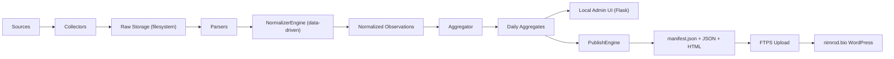

# החלטות אדריכליות מרוכזות

גרסה: 1.1  
תאריך: 2026-03-29  
שינויים מגרסה 1.0: סגירת SQLite/PostgreSQL, הגדרת Python stack, הוספת normalizer data-driven, basket policy, publish threshold, stale data

## 1. מטרת המסמך

לרכז בצורה אחת מסודרת:

- איך המידע זורם במערכת מקצה לקצה
- איך הנתונים נשמרים מקומית
- איך הנתונים נשמרים אונליין
- איך האתר הציבורי מתעדכן
- מהו תפקיד ממשק ה-admin המקומי
- ההחלטות שנסגרו ב-v1.1

## 2. החלטות stack — סגורות סופית

### שפת פיתוח

**Python 3.11+**

נימוק: רוב הפרויקטים הקיימים בסביבת הפיתוח הם Python. agents מפתחים — Python אידיאלי לעבודת agents (scraping, data processing, CLI tools).

### ממשק admin

**Flask** (Python web framework)

נימוק: הפשוט ביותר, minimal configuration, קל לagents לבנות templates.

### ORM + Migrations

**SQLAlchemy 2.x + Alembic**

### HTTP + Scraping

**httpx** (async-capable) + **BeautifulSoup4**

### Scheduler

**cron** (מערכת הפעלה) — ללא dependency על framework scheduler

### בסיס נתונים

**PostgreSQL** (ישירות על המכשיר, ללא Docker)

**ביטול החלטות קודמות:** המלצות SQLite שהופיעו ב-`INITIAL_PROJECT_PLAN_HE.md` ו-`ARCHITECTURE_DECISIONS_HE.md` v1.0 — **בוטלו**. הסיבה: מודל הנתונים מורכב (16+ טבלאות, JSONB fields, indexes), ו-PostgreSQL חוסך migration עתידי.

```bash
# התקנה
brew install postgresql@16   # macOS
# או: sudo apt install postgresql  # Ubuntu/Debian

# יצירת DB
createdb smallfarms_local
createuser smallfarms_app
psql -c "GRANT ALL ON DATABASE smallfarms_local TO smallfarms_app;"
```

## 3. זרימת המידע במערכת

### זרימה מלאה

1. מוגדרת רשימת מקורות במערכת המקומית.
2. job יומי (cron 06:00) מפעיל collectors.
3. כל collector מושך snapshot מהמקור.
4. נשמר `raw payload` לכל מקור על filesystem.
5. parser ייעודי לכל normalizer_type מפיק `raw_extracted_items`.
6. מנגנון normalization (data-driven מ-DB) ממפה:
   - שם מוצר (via aliases + rules)
   - יחידת מידה (via unit_map rules)
   - מחיר (המרה ל-base unit)
   - organic flag
   - confidence score
7. aggregation מחשב daily stats (weighted + unweighted).
8. QA מזהה outliers, duplicates, missing sources.
9. publish builder מייצר public artifacts.
10. upload ב-FTPS לשרת uPress.
11. WordPress public page קורא manifest → מציג artifact.

### תרשים



## 4. מה נשמר מקומית

### שכבות מקומיות

#### raw files (filesystem)

```
/data/smallfarms/raw/{year}/{month}/{day}/{source_code}_{timestamp}.{ext}
```

#### operational database (PostgreSQL)

שומר: מקורות, profiles, normalizer rules/aliases, runs, observations, aggregates, publish history, users, audit_log, logs.

#### artifacts (filesystem)

```
/data/smallfarms/artifacts/market/
  public_report-{version}.json
  public_report-{version}.html
  manifest.json
  manifest_last_good.json
```

## 5. מה נשמר אונליין

**החלטה סופית:** `public_report-{version}.json + public_report-{version}.html + manifest.json + manifest_last_good.json`

בנתיב: `/wp-content/uploads/market/`

### למה זו ההחלטה

- לא תלוי ב-DB של וורדפרס
- artifacts עצמאיים, portable
- upload פשוט ב-FTPS
- fallback קל (`manifest_last_good.json`)
- versioned filenames מתמודדים עם CDN cache

## 6. מנגנון publish — החלטות סגורות

### upload mechanism

**FTPS** — נתיב ראשי.  
SSH/rsync — רק אם uPress מאשרים במפורש (דורש בדיקה).

### publish cadence

**daily** לאחר successful run, + override ידני מ-admin.

### publish threshold

**לפחות 2 מקורות community הצליחו.**  
benchmark אינו חובה לpublish.

### atomicity order

1. העלה `public_report-{version}.json`
2. העלה `public_report-{version}.html`
3. אמת checksums
4. **רק אז** עדכן `manifest.json`
5. עדכן `manifest_last_good.json`

אם שלב כלשהו נכשל — abort, לא לעדכן manifest.

### failure behavior

- publish נכשל → נשאר עם `last good` manifest
- WP renderer: קורא `manifest.json` → אם version לא נגיש → fallback ל-`manifest_last_good.json`

## 7. stale data policy

```
manifest.staleness_level = 'ok'       → תצוגה רגילה
manifest.staleness_level = 'warning'  → banner צהוב (3-8 ימים)
manifest.staleness_level = 'stale'    → banner אדום (>8 ימים)
```

המחשב המקומי מחשב `staleness_level` בעת build ומכניס ל-`manifest.json`. WordPress renderer לא מחשב — רק קורא ומציג.

email alert נשלח:
- אם run נכשל לחלוטין
- אם לא היה publish מוצלח ב-2 ימים (אזהרה מוקדמת)

## 8. normalizer — החלטה מרכזית

**המנגנון data-driven לחלוטין.**

כל rules, aliases, merges, flags — ב-PostgreSQL.  
Admin/agent משנה בלי deploy.  
שינוי גורם לתוצאה שונה בריצה הבאה.

ראו: `NORMALIZER_SPEC_HE.md`

## 9. basket policy — החלטה סגורה

**Baskets הם מוצרים עצמאיים.**

- `is_basket_product = true` ב-products table
- מחיר סל אינו ממיר לק"ג
- aggregate נפרד: `is_basket_aggregate = true`
- מוצגים בממשק ציבורי בשכבה נפרדת
- פירוק לפריטים נדחה לגרסה עתידית

## 10. מינימום לפרסום ציבורי

**2 תצפיות מ-2 מקורות שונים לפחות** — לכל מוצר.

שדה: `daily_aggregates.meets_publish_threshold = true/false`

מוצר עם `meets_publish_threshold = false` נשמר ב-DB (לא נמחק) אבל לא מופיע בדוח הציבורי.

## 11. תפקיד ממשק ה-admin המקומי

admin V1 חייב לאפשר:

- צפייה בריצות, logs, raw, observations
- QA וסימון חריגות
- publish ידני / override
- **ניהול normalizer: aliases, rules, merges, observation flags** — ללא deploy

admin V1 לא נדרש לאפשר:

- CRUD מלא למקורות
- עריכת fetch profiles מ-UI
- ניהול משתמשים

## 12. auth — החלטות לפי phase

| Phase | auth |
|---|---|
| Phase A (dev machine, 127.0.0.1) | ללא auth — binding מגן |
| Phase B (dedicated PC / LAN) | HTTP Basic Auth או login יחיד |

## 13. easyFarm dependency

חמישה מקורות (SRC002–SRC006) הם תת-דומיינים של `easyfarm.co.il`.

**ניהול הסיכון:**
- `platform_family = 'easyfarm'` בכל fetch profile הרלוונטי
- collector גנרי אחד שמקבל site כפרמטר
- ניטור easyFarm כ-dependency קריטית

## 14. החלטות שהוסרו מ-V1

| נושא | החלטה |
|---|---|
| פילטר אזור/region | הוסר — אין שדה region בV1 |
| legal scraping של Pricez/CHP | נדחה — legal_review_required=true |
| SSH/rsync לuPress | נדחה — ממתין לבדיקת uPress |
| פירוק סלים לפריטים | נדחה לV2 |
| auth ב-Phase A | לא נדרש (local-only) |

## 15. recommendation set סופי V1.1

1. **Python 3.11+** כשפה יחידה
2. **Flask** לadmin UI
3. **PostgreSQL** מקומי ללא Docker
4. **filesystem** ל-raw ו-artifacts
5. **local web admin** חובה מ-V1, כולל normalizer management
6. admin נגיש רק ב-`127.0.0.1`
7. **normalizer data-driven** — rules ב-DB
8. **baskets כמוצרים עצמאיים**
9. publish מבוסס `manifest.json + versioned artifacts`
10. העלאה ב-`FTPS` (לאחר proof test)
11. `last good + manifest_last_good.json` חובה
12. `staleness_level` ב-manifest, banners ציבוריים
13. benchmark מופרד ויזואלית
14. admin V1 — ניטור, normalizer, QA, publish
15. email alert על כשל ריצה / staleness
