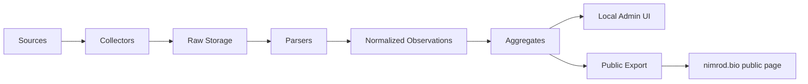

# החלטות אדריכליות מרוכזות

תאריך: 2026-03-29

## 1. מטרת המסמך

לרכז בצורה אחת מסודרת:

- איך המידע זורם במערכת מקצה לקצה
- איך הנתונים נשמרים מקומית
- איך הנתונים נשמרים אונליין
- איך האתר הציבורי מתעדכן
- מהו תפקיד ממשק ה-admin המקומי
- אילו החלטות צריך לנעול לפני כתיבת קוד

## 2. זרימת המידע במערכת

### זרימה מלאה

1. מוגדרת רשימת מקורות במערכת המקומית.
2. job יומי מפעיל collectors.
3. כל collector מושך snapshot מהמקור.
4. נשמר `raw payload` לכל מקור:
   - HTML
   - JSON
   - PDF
   - metadata של request
5. parser מפיק `observations` מתוך ה-raw.
6. מנגנון normalization ממפה:
   - שם מוצר
   - יחידת מידה
   - סוג שוק
   - ערוץ שיווק
   - organic flag
7. מנגנון aggregation מחשב:
   - average
   - median
   - stddev
   - min/max
   - sample size
8. ממשק admin מקומי מציג:
   - runs
   - logs
   - raw
   - observations
   - anomalies
9. publish builder מייצר אובייקט ציבורי נקי.
10. האובייקט הציבורי מועלה לשרת של `nimrod.bio`.
11. עמוד WordPress ציבורי מציג רק את האובייקט הציבורי.

### תרשים קצר

## 3. מה נשמר מקומית

### שכבות מקומיות

#### raw files

- כל קובץ שנמשך ממקור
- נשמר על דיסק
- לפי source id ותאריך

#### operational database

- DB מקומי פשוט, רצוי `SQLite`
- שומר:
  - מקורות
  - runs
  - observations
  - aggregates
  - publish history

#### logs

- לוג אפליקטיבי
- לוג fetch
- לוג publish

### החלטה מומלצת

מקומית נכון להשתמש ב:

- `SQLite` לנתונים מבניים
- filesystem ל-raw files ול-artifacts

זה הפתרון הפשוט והנכון ביותר ל-V1.

## 4. מה נשמר אונליין

זו השאלה הקריטית ביותר.

המטרה באונליין היא לא לנהל את המערכת, אלא רק להציג תוצאה ציבורית.

### חלופה A: שימוש ב-DB של WordPress

#### מה זה אומר

- לשמור aggregates כ-post meta / custom table / option בתוך וורדפרס
- עמוד הוורדפרס יקרא מה-DB שלו

#### יתרונות

- הכל "בתוך" וורדפרס
- אין upload נפרד של קבצים

#### חסרונות

- תלות עמוקה בוורדפרס
- schema פחות נקי
- תחזוקה יותר מסורבלת
- import/update פחות שקופים
- recovery פחות פשוט
- דוחף אתכם מוקדם מדי ל-plugin logic

#### מסקנה

לא מומלץ ל-V1.

### חלופה B: קובץ `JSON` ציבורי שמתעדכן בכל publish

#### מה זה אומר

- המערכת המקומית מייצרת `public_report.json`
- הקובץ מועלה לשרת
- עמוד הוורדפרס קורא JSON ומציג אותו

#### יתרונות

- אובייקט עצמאי ופשוט
- portable
- קל לשחזור ולבדיקה
- לא תלוי ב-DB של וורדפרס
- טוב להמשך אם תרצו עוד consumers

#### חסרונות

- דורש שכבת rendering בעמוד הוורדפרס
- אם ה-JSON משתנה, גם ה-renderer צריך להתעדכן
- צריך לטפל במצב של JSON חסר/פגום

#### מסקנה

מועמד חזק מאוד.

### חלופה C: קובץ `HTML` ציבורי מוכן

#### מה זה אומר

- המערכת המקומית מייצרת partial HTML מוכן
- וורדפרס מטמיע אותו כפי שהוא

#### יתרונות

- פשוט מאוד לתצוגה
- כמעט בלי לוגיקת client/server בתוך וורדפרס
- שליטה מלאה על הפלט

#### חסרונות

- פחות גמיש
- קשה יותר להוסיף אינטראקציות וסינונים
- פחות clean כ-data contract

#### מסקנה

טוב אם רוצים פשטות מקסימלית בתצוגה.

### חלופה D: `JSON + HTML` יחד

#### מה זה אומר

- נשמרים גם `public_report.json` וגם `public_report.html`
- JSON הוא ה-canonical public data object
- HTML הוא fallback/view-ready artifact

#### יתרונות

- גמיש מאוד
- ה-HTML נותן fallback מיידי
- ה-JSON נותן אובייקט נקי
- טוב לדיבוג ולשחזור

#### חסרונות

- שני artifacts במקום אחד
- צריך לשמור עקביות ביניהם

#### מסקנה

זו החלופה הטובה ביותר ל-V1/V1.5.

### חלופה E: SQLite/DB עצמאי אונליין

#### מה זה אומר

- להעלות DB עצמאי או service קטן לשרת
- וורדפרס או endpoint אחר יקראו ממנו

#### יתרונות

- גמיש לעתיד
- שומר מבנה נתונים מלא יחסית

#### חסרונות

- הרבה יותר מורכב
- דורש runtime נוסף
- דורש auth/ops/backup
- חורג מהמטרה של "פשוט"

#### מסקנה

לא מומלץ ל-V1.

## 5. איך האתר הציבורי מתעדכן

### חלופה 1: Upload ידני

#### איך זה עובד

- מריצים publish מקומית
- מעלים artifact ידנית

#### יתרונות

- פשוט מאוד
- טוב לתחילת פיתוח

#### חסרונות

- תלוי בבן אדם
- חשוף לטעויות

#### המלצה

מתאים לשלב פרוטוטייפ בלבד.

### חלופה 2: Upload אוטומטי ב-command

#### איך זה עובד

- publish builder יוצר artifacts
- command ייעודי מעלה אותם ב-SFTP/rsync

#### יתרונות

- פשוט
- repeatable
- לא צריך API

#### חסרונות

- צריך credentials מסודרים
- צריך לטפל בכישלון upload

#### המלצה

הפתרון המומלץ ל-V1.

### חלופה 3: Push ל-endpoint בשרת

#### איך זה עובד

- local machine שולח data ל-endpoint בשרת

#### יתרונות

- גמיש
- future-friendly

#### חסרונות

- מוסיף endpoint, auth, validation
- כבר לא "פשוט"

#### המלצה

לא ל-V1.

## 6. המלצה מרוכזת לשכבת האונליין

### המלצה

לשמור אונליין:

- `public_report.json`
- `public_report.html`

בנתיב קבוע על שרת הוורדפרס, למשל:

- `/wp-content/uploads/market/public_report.json`
- `/wp-content/uploads/market/public_report.html`

### למה זו ההמלצה

- לא תלוי ב-DB של וורדפרס
- אובייקט עצמאי ופשוט
- upload קל
- fallback קל
- future-proof יותר מ-HTML בלבד
- פשוט יותר מ-DB או API

## 7. מהו תפקיד ממשק ה-admin המקומי

הדרישה שלך נכונה: ממשק admin מקומי חייב להתקיים מהיום הראשון.

לא בשביל "ניהול משתמשים", אלא בשביל:

- לוג וניטור
- הבנת מצב המערכת
- בדיקת כשלונות
- צפייה ב-raw
- בדיקת parser
- QA לפני publish

בלי זה, באמת תהיו עיוורים.

### מסכי חובה ל-V1 admin

1. Dashboard
2. Sources
3. Runs
4. Observations
5. QA / anomalies
6. Publish

המסכים הללו נועדו ל:

- ניטור
- לוגים
- QA
- rerun ידני
- publish override

הם לא נועדו ב-V1 ל:

- ניהול מקורות מלא
- עריכת normalizers דרך UI
- ניהול מוצרים דרך UI

### מה לא חייב להיכנס ל-V1 admin

- ניהול משתמשים
- הרשאות מורכבות
- מערכת settings עשירה
- CRUD מלא לכל ישות

## 8. חלופות לממשק admin מקומי

### חלופה A: רק CLI ולוגים בקבצים

#### יתרון

- הכי פשוט

#### חסרון

- עיוורון תפעולי
- קשה להבין כשלים
- לא מתאים לצורך שהגדרת

#### מסקנה

לא מתאים.

### חלופה B: local web admin

#### יתרון

- הכי מאוזן
- מהיר לבדיקה
- טוב לניטור ול-QA
- מתאים ל-`127.0.0.1`

#### חסרון

- צריך להשקיע קצת UI בסיסי

#### מסקנה

הפתרון המומלץ.

### חלופה C: desktop app מקומית

#### יתרון

- תחושת כלי ייעודי

#### חסרון

- מורכב מדי
- לא תואם goal של פשטות

#### מסקנה

לא מומלץ.

## 9. תשובה ישירה לשאלת auth/admin

### מה נכון עכשיו

- ב-V1: local web admin מהיום הראשון
- אם הוא נגיש רק ב-`127.0.0.1`, לא חייבים auth אפליקטיבי מיידית
- אם יש אפילו סיכוי לחשיפה ברשת מקומית או PC ייעודי, כדאי להוסיף שכבת הגנה בסיסית

### המלצה

- `Phase A`: local-only ללא auth אפליקטיבי, אבל עם binding קשיח ל-`127.0.0.1`
- `Phase B`: local/LAN + `Basic Auth` או login יחיד

## 10. החלטות שצריך לנעול לפני קוד

להלן כל ההחלטות שצריך לסגור.

| ID | נושא | אופציות | השלכה | המלצה |
|---|---|---|---|---|
| D01 | storage מקומי מבני | SQLite / Postgres / files only | משפיע על מורכבות תפעולית | `SQLite` |
| D02 | storage מקומי ל-raw | filesystem / DB blobs | משפיע על פשטות וגודל DB | `filesystem` |
| D03 | admin מקומי | CLI only / local web UI / desktop app | משפיע על ניטור ו-QA | `local web UI` |
| D04 | auth ל-admin בשלב A | none / basic auth / app login | משפיע על מהירות הקמה ופשטות | `none`, רק אם local-only אמיתי |
| D05 | auth ל-admin בשלב B | none / basic auth / app login | משפיע על סיכון אבטחה | `basic auth` או login יחיד |
| D06 | public storage online | WordPress DB / JSON / HTML / JSON+HTML / independent DB | משפיע על coupling ופשטות | `JSON+HTML` |
| D07 | public renderer | WP block / shortcode / page template | משפיע על מאמץ צד WP | `page template` פשוט או block קטן |
| D08 | upload mechanism | manual / SFTP / rsync / endpoint push | משפיע על אמינות ו-ops | `SFTP` או `rsync` |
| D09 | publish cadence | manual / daily after run / manual override | משפיע על freshness ו-control | `daily after successful run` + manual override |
| D10 | benchmark placement | same page / tab / separate page | משפיע על בהירות UX | `same page` עם tab/section נפרד |
| D11 | public artifact contract | thin JSON / rich JSON | משפיע על future flexibility | `rich JSON` ציבורי אבל ללא source internals |
| D12 | failure behavior | publish partial / keep last good / blank page | משפיע על אמינות ציבורית | `keep last good` |
| D13 | admin חובה ב-V1 | yes / no | משפיע על שליטה במערכת | `yes` |
| D14 | WordPress coupling level | deep plugin / light template / static embed | משפיע על תחזוקה | `light template + public artifacts` |

## 11. recommendation set סופי

### Recommendation Pack V1

1. מנוע מקומי עם `SQLite + filesystem`.
2. `local web admin` מהיום הראשון.
3. admin נגיש רק ב-`127.0.0.1`.
4. raw נשמרים על דיסק.
5. publish ציבורי מבוסס `JSON+HTML`.
6. העלאה לשרת ב-`SFTP` או `rsync`.
7. עמוד וורדפרס קל שקורא artifact ציבורי בלבד.
8. אין שימוש ב-DB של וורדפרס כ-store של המערכת.
9. אם publish נכשל, נשארים עם `last known good`.
10. benchmark מוצג בנפרד ויזואלית מהשוק הקהילתי.
11. admin V1 מיועד לניטור והרצת תהליכים ידנית, לא לניהול תוכן/config מלא.

## 12. ניסוח חד של ההחלטה לגבי WordPress

וורדפרס הוא `presentation layer`, לא `system of record`.

ה-system of record של המערכת יהיה מקומי.
השרת הציבורי יקבל רק public artifacts.

זו ההחלטה הכי חשובה לשמירת פשטות המערכת.
