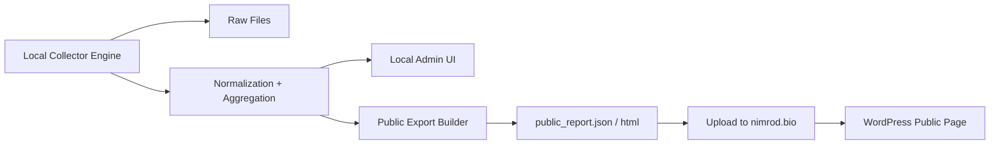

# אפיון מערכת מפורט

תאריך: 2026-03-29

## 1. מטרת המסמך

להגדיר את הארכיטקטורה, תהליכי העבודה, מודל הפריסה, הממשקים, זרימת הנתונים והחלטות המימוש של המערכת לפני תחילת כתיבת קוד.

המסמך הזה מניח:

- הפרויקט צריך להישאר פשוט
- שכבת הניהול צריכה להישאר מקומית ככל האפשר
- הממשק הציבורי צריך לחיות בתוך אתר הוורדפרס הקיים `nimrod.bio`
- המערכת הציבורית תציג אגרגציה בלבד, בלי חשיפת מקור ספציפי

## 2. החלטה אדריכלית מוצעת

### ההצעה

לאמץ ארכיטקטורה של `Local Data Hub + Public WordPress Surface`.

כלומר:

1. סביבת הפיתוח המקומית מריצה collectors, parsers, normalization ואגרגציה.
2. ממשק הניהול חי רק בסביבה המקומית.
3. המערכת המקומית מייצרת artifact ציבורי מצומצם:
   - `public_report.json`
   - `public_report.html`
4. artifact זה מועלה לשרת של `nimrod.bio`.
5. עמוד וורדפרס ציבורי מציג את המידע מתוך ה-artifact הציבורי בלבד.
6. בשלב מאוחר יותר הסביבה המקומית עוברת לרוץ על PC ישן ייעודי.

### החלטה

ההצעה נכונה ומתאימה ל-V1, עם תיקון חשוב אחד:

המערכת הציבורית לא צריכה לדבר ישירות עם סביבת הפיתוח המקומית, אלא רק לקבל ממנה export סטטי או חצי-סטטי. זה שומר על פשטות, מצמצם אבטחה, ומונע תלות ישירה במחשב הפיתוח.

## 3. ניתוח חלופות

| חלופה | יתרון | חסרון | החלטה |
|---|---|---|---|
| מערכת ווב מלאה עם admin ו-auth בשרת הציבורי | מערכת אחת, כתובת אחת | יותר אבטחה, יותר auth, יותר תחזוקה | לא מומלץ ל-V1 |
| הכל בתוך וורדפרס | נוח לפרסום ציבורי | וורדפרס לא מתאים להיות מנוע scraping, parsing ו-QA | לא מומלץ |
| מערכת מקומית בלבד ללא אתר ציבורי | הכי פשוט טכנית | לא עונה על צורך קהילתי פתוח | לא מתאים |
| מערכת מקומית + פרסום ציבורי סטטי לוורדפרס | פשוט, בטוח יחסית, גמיש, זול לתחזוקה | דורש מנגנון publish נפרד | מומלץ |
| מערכת מקומית + iframe מהמחשב המקומי | פשוט לכאורה | שביר, חשוף, תלוי בזמינות מחשב מקומי | לא מומלץ |

## 4. הקשר לאתר `nimrod.bio`

בבדיקה ציבורית של `nimrod.bio` ב-2026-03-29 נצפו המאפיינים הבאים:

- אתר וורדפרס קיים עם שפה תוכנית וחמה
- טון קהילתי, אקולוגי ולא "מוצרי SaaS"
- ניווט, בלוג, אזורי תוכן עשירים ו-CTA פשוטים
- שפה ויזואלית שמתאימה לתוכן חקלאי-קהילתי ולא ללוח מחוונים טכני
- קיימת כבר מורכבות frontend מסוימת, כולל JS צד-לקוח וטפסי קשר

### מסקנת UI

הממשק הציבורי החדש צריך להיראות כמו עוד עמוד טבעי באתר:

- עברית מלאה
- טון קהילתי
- צבעוניות אדמתית/ירוקה
- היררכיה תוכנית ברורה
- מעט אינטראקציה, בלי להיראות כמו מערכת enterprise

לא נכון לשתול באתר dashboard טכני או SPA כבד.

## 5. עקרונות תכנון

- `simple first`
- איסוף מקומי, חשיפה ציבורית מינימלית
- הפרדה מוחלטת בין data internals לבין public presentation
- אין API ציבורי ב-V1
- אין משתמשים ציבוריים
- אין חשיפת מקורות לציבור
- כל run נשמר
- כל publish ציבורי ניתן לשחזור

## 6. תרשים מערכת

## 7. רכיבי המערכת

### 7.1 מנוע נתונים מקומי

אחראי על:

- רישום מקורות
- fetch למקורות
- שמירת raw
- parsing
- normalization
- אגרגציה
- בניית export ציבורי

### 7.2 ממשק ניהול מקומי

אחראי על:

- צפייה במקורות
- צפייה ב-runs
- צפייה ב-observations
- QA
- סימון חריגות
- הרצה ידנית של תהליכים
- publish ידני כ-override או rerun

זהו רכיב חובה ב-V1, לא nice-to-have.

ב-V1 הממשק הזה הוא כלי פיתוח, ניטור ותפעול, ולא מסך ניהול עסקי מלא.

### 7.3 בונה export ציבורי

אחראי על:

- חילוץ subset ציבורי בלבד
- בניית JSON ציבורי
- בניית partial HTML או static block
- הטמעת timestamp של publish
- מניעת דליפת source identifiers

### 7.4 ממשק וורדפרס ציבורי

אחראי על:

- הצגת המחירון
- הצגת היסטוריה בסיסית
- הצגת disclaimer על אגרגציה
- הצגת benchmark בנפרד

## 8. מודל פריסה

### שלב A: סביבת פיתוח

- הכל רץ על מחשב הפיתוח
- ממשק admin זמין רק מקומית
- binding ל-`127.0.0.1`
- publish ציבורי נעשה אוטומטית אחת ליום אחרי run מוצלח
- בממשק המקומי יש יכולת rerun / publish override ידני

### שלב B: PC ישן ייעודי

- המנוע המקומי עובר למחשב ייעודי
- cron רץ שם
- publish ציבורי נעשה אוטומטית
- הגישה לממשק admin תישאר:
  - local only
  - או VPN/LAN בלבד

### החלטה חשובה

גם בשלב B לא נכון לחשוף admin פתוח לאינטרנט.

## 9. מודל אבטחה והרשאות

ההצעה שלך לצמצם את auth נכונה, אבל צריך לדייק:

### בממשק הציבורי

- אין login
- אין חשבון משתמש
- אין נתונים רגישים

### בממשק המנהל בשלב A

אם הוא רץ רק על `127.0.0.1`, אפשר להסתפק בהגנת מערכת ההפעלה, בלי auth אפליקטיבי בשלב הראשון.

עם זאת, ממשק admin מקומי עצמו הוא חובה כבר בשלב הראשון לצורכי פיתוח, ניטור ולוגים.

### בממשק המנהל בשלב B

אם הוא עובר למחשב ייעודי, מומלץ להוסיף לפחות אחת מהאפשרויות הבאות:

- `HTTP Basic Auth` ברמת שרת מקומי
- login אפליקטיבי יחיד

### החלטה מומלצת

- `Phase A`: ללא auth אפליקטיבי, כל עוד admin local-only
- `Phase B`: auth בסיסי יחיד למשתמש מנהל

כך שומרים על פשטות בלי לנעול את עצמנו לפתרון מסוכן בהמשך.

## 10. מנגנון פרסום ל-WordPress

זו ההחלטה הטכנית החשובה ביותר ב-V1.

### אפשרות מומלצת

המערכת המקומית תייצר:

- `public_report.json`
- `public_report.html`

ותעלה אותם לשרת של וורדפרס, למשל לנתיב ייעודי:

- `/wp-content/uploads/market/public_report.json`
- `/wp-content/uploads/market/public_report.html`

### איך עמוד הוורדפרס יציג את הנתונים

יש שלוש אפשרויות:

1. shortcode קטן שקורא JSON ציבורי ומציג אותו
2. block HTML שמטמיע partial HTML מוכן
3. page template ייעודי שטוען JSON ומרנדר

### המלצה

ל-V1:

- להשתמש ב-`public_report.html` או `public_report.json`
- להציג אותו דרך page template פשוט או block ייעודי
- לא לבנות plugin כבד

### למה זה טוב

- אין צורך ב-API חי
- אין צורך ב-auth בין הוורדפרס למערכת המקומית בזמן ריצה
- אין חשיפת admin
- אפשר לשחזר publish בקלות

## 11. זרימת עבודה מלאה

1. `cron` מפעיל סריקה.
2. כל מקור נשמר כ-raw.
3. parser מייצר observations.
4. normalization מאחד שמות, יחידות וערוצים.
5. aggregation מחשב public metrics.
6. QA מקומי מזהה חריגות.
7. publish builder יוצר export ציבורי.
8. export מועלה לשרת הוורדפרס.
9. עמוד `nimrod.bio` הציבורי מציג את ה-export האחרון.

## 12. מודל נתונים ברמת מערכת

### שכבת raw

- קובצי HTML/JSON/PDF שנשמרו
- metadata לכל fetch

### שכבת normalized observations

- observation לכל מוצר/מקור/זמן
- שדות נרמול
- confidence

### שכבת aggregates

- daily public aggregates
- benchmark aggregates
- historical aggregates

### שכבת publish

- artifacts ציבוריים
- version של publish
- published_at

## 13. הגדרת subset ציבורי

הממשק הציבורי יציג רק:

- שם מוצר
- טווח תאריך/עדכון
- מחיר ממוצע
- חציון
- סטיית תקן
- מינימום
- מקסימום
- מספר תצפיות
- שיוך שוק:
  - שוק קהילתי-אורגני
  - benchmark רשתות

הממשק הציבורי לא יציג:

- source name
- URL source
- raw values
- parser diagnostics
- internal confidence comments

## 14. מודל ה-admin המקומי

ה-admin צריך לכלול את המסכים הבאים:

### Dashboard

- status של הריצה האחרונה
- מספר מקורות פעילים
- מספר כשלונות
- publish status

### Sources

- רשימת מקורות
- סוג מקור
- עדיפות
- סטטוס חיבור
- fetch profile

### Runs

- היסטוריית ריצות
- זמן התחלה/סיום
- שגיאות
- קישור ל-raw

### Observations

- תצפיות גולמיות
- ערך מנורמל
- confidence
- benchmark flag

### QA

- חריגות
- חוסרים
- כפילויות
- unit mismatch

### Publish

- preview ציבורי
- timestamp
- build artifacts
- upload status
- manual rerun
- trigger יזום לסריקה / normalization / publish

## 15. החלטות UX

### ציבורי

- לא dashboard
- כן עמוד תוכן-נתונים
- כן טקסט הסבר קצר על המתודולוגיה
- כן כרטיסי מוצרים וטבלה קריאה
- כן benchmark בנפרד

### admin

- utilitarian
- טבלאי
- קריא ומהיר
- ללא השקעת עיצוב מיותרת בשלב ראשון
- ממוקד ניטור, לוגים, QA והרצת תהליכים ידנית

## 16. שפת עיצוב ציבורית

בהתאם ל-`nimrod.bio`:

- רקע בהיר
- ירוקים/חומים/קרם
- כותרות חמות ולא טכניות
- CTA עדינים
- קופסאות מידע עם אוויר
- פחות "גרפים נוצצים", יותר קריאות

## 17. סיכונים והפחתה

| סיכון | השפעה | הפחתה |
|---|---|---|
| תלות במחשב פיתוח | publish נפסק כשהמחשב כבוי | מעבר עתידי ל-PC ייעודי |
| publish ל-WordPress נשבר | האתר הציבורי מציג מידע ישן | לשמור last good artifact |
| מקור משתנה | parser נשבר | QA + source versioning |
| admin נחשף בטעות | סיכון אבטחה | local-only binding |
| עמוד ציבורי נראה זר לאתר | UX חלש | להטמיע בתוך theme/WordPress |

## 18. החלטות לביצוע לפני קוד

לפני שמתחילים לפתח, צריך לנעול:

1. האם publish יהיה דרך `public_report.html`, `public_report.json`, או שניהם
2. האם upload לשרת ייעשה ב-SFTP, rsync, או דרך endpoint פשוט
3. האם ב-Phase A יש auth אפליקטיבי או local-only ללא auth
4. אילו מסכים בדיוק ייכנסו ל-admin של V1
5. אילו KPI יופיעו בעמוד הציבורי
6. מהי תדירות ה-publish
7. האם benchmark יופיע באותו עמוד או בטאב נפרד

החלטה שכבר נסגרה:

- admin מקומי הוא חובה מיום ראשון
- admin V1 הוא כלי פיתוח ותפעול, לא CRUD מלא של מקורות/normalizers

## 19. המלצה סופית

הארכיטקטורה המומלצת ל-V1 היא:

- מנוע נתונים מקומי
- admin מקומי בלבד
- publish ציבורי סטטי ל-WordPress
- ללא auth ציבורי
- ללא חשיפת source internals
- עם עיצוב מוטמע בשפה של `nimrod.bio`
- עם admin מקומי חובה לניטור והרצת תהליכים כבר מ-V1

זה הפתרון הכי פשוט שעונה על המטרות שלכם, בלי לייצר מראש מערכת כבדה מדי.
