> **LANGUAGE NOTICE:** This document is a legacy Hebrew specification (MyFarmAgents v1.1).
> Platform: **MyFarmAgents** | Agent: **OrganicMarketAgent**
> All new documents are written in English. See `docs/GLOSSARY.md` for canonical terminology.
> This file is pending English rewrite — scheduled per milestone.

---

# אפיון מערכת מפורט

גרסה: 1.1  
תאריך: 2026-03-29  
שינויים מגרסה 1.0: Python/Flask stack, normalizer admin מסך, alerting spec, manifest fallback, basket policy, agent-friendly code structure

## 1. מטרת המסמך

להגדיר את הארכיטקטורה, תהליכי העבודה, מודל הפריסה, הממשקים, זרימת הנתונים והחלטות המימוש של המערכת לפני תחילת כתיבת קוד.

## 2. החלטה אדריכלית — סגורה

**`Local Data Hub + Public WordPress Surface`**

**Python 3.11+ + Flask + PostgreSQL (ישירות, ללא Docker)**

- Agents מפתחים את המערכת — מבנה מודולרי חיוני
- venv + requirements.txt לניהול dependencies
- כל module עצמאי — collectors, parsers, normalizer, aggregator, publisher, admin

## 3. מבנה פרויקט — agent-friendly

```
smallfarms/
├── collectors/              # fetch ממקורות
│   ├── __init__.py
│   ├── engine.py            # CollectorEngine
│   ├── easyfarm.py          # easyFarm generic collector
│   ├── json_api.py          # JSON endpoint collector
│   └── pdf_downloader.py
├── parsers/                 # חילוץ items מ-raw
│   ├── __init__.py
│   ├── engine.py            # ParserEngine (dispatcher)
│   ├── easyfarm_catalog.py
│   ├── simple_product_grid.py
│   ├── basket_only.py
│   ├── retail_benchmark.py
│   └── official_wholesale.py
├── normalizer/              # נרמול data-driven
│   ├── __init__.py
│   ├── engine.py            # NormalizerEngine
│   ├── alias_resolver.py
│   ├── unit_resolver.py
│   ├── price_resolver.py
│   └── confidence.py
├── aggregator/              # חישוב daily/weekly
│   ├── __init__.py
│   ├── engine.py            # AggregatorEngine
│   └── weekly.py
├── qa/                      # QA ו-anomaly detection
│   ├── __init__.py
│   └── engine.py            # QAEngine
├── publisher/               # build + upload artifacts
│   ├── __init__.py
│   ├── engine.py            # PublishEngine
│   ├── builder.py           # JSON + HTML builder
│   ├── uploader.py          # FTPS upload
│   └── templates/
│       └── public_report.html.jinja2
├── admin/                   # Flask admin UI
│   ├── __init__.py
│   ├── app.py               # Flask app factory
│   ├── routes/
│   │   ├── dashboard.py
│   │   ├── sources.py
│   │   ├── runs.py
│   │   ├── observations.py
│   │   ├── qa.py
│   │   ├── publish.py
│   │   └── normalizer.py    # aliases, rules, merges, flags
│   ├── templates/
│   └── static/
├── models/                  # SQLAlchemy models
│   ├── __init__.py
│   ├── base.py
│   ├── measurement.py       # measurement_units, unit_conversions
│   ├── products.py          # products, aliases, variants, merges
│   ├── sources.py           # sources, fetch_profiles
│   ├── normalizer.py        # profiles, rules, observation_flags
│   ├── runs.py              # ingestion_runs, source_fetch_runs, raw_assets
│   ├── observations.py      # raw_extracted_items, normalized_observations
│   ├── aggregates.py        # daily_aggregates, weekly_snapshots
│   ├── publish.py           # publish_runs, publish_artifacts
│   └── users.py             # users, audit_log, log_entries
├── db/                      # migrations + seed
│   ├── session.py
│   ├── alembic.ini
│   └── versions/
│       ├── 001_initial_schema.py
│       ├── 002_seed_units.py
│       ├── 003_seed_products.py
│       └── 004_seed_sources.py
├── scheduler/               # cron entry points
│   ├── run_daily.py
│   └── check_staleness.py
├── utils/                   # shared utilities
│   ├── alerts.py            # email alerts
│   ├── checksums.py
│   ├── logging.py
│   └── config.py
├── tests/                   # per-module tests
│   ├── test_normalizer.py
│   ├── test_aggregator.py
│   └── test_publisher.py
├── requirements.txt
├── .env.example
└── README.md
```

## 4. dependencies (requirements.txt)

```
# Core
sqlalchemy>=2.0
alembic>=1.13
psycopg2-binary>=2.9
httpx>=0.27

# Parsing
beautifulsoup4>=4.12
lxml>=5.1

# Admin UI
flask>=3.0
flask-login>=0.6
jinja2>=3.1

# Utils
python-dotenv>=1.0
click>=8.1

# Dev / Test
pytest>=8.0
pytest-cov
```

## 5. תרשים מערכת

```mermaid
flowchart LR
    A["cron 06:00"] --> B["IngestionRunner"]
    B --> C["CollectorEngine"]
    C --> D["raw files (filesystem)"]
    D --> E["ParserEngine"]
    E --> F["raw_extracted_items (DB)"]
    F --> G["NormalizerEngine (data-driven)"]
    G --> H["normalized_observations (DB)"]
    H --> I["AggregatorEngine"]
    I --> J["daily_aggregates (DB)"]
    J --> K["QAEngine"]
    K --> L["PublishEngine"]
    L --> M["artifacts (filesystem)"]
    M --> N["FTPS Upload"]
    N --> O["nimrod.bio WordPress"]
    J --> P["Flask Admin UI"]
```



## 6. רכיבי המערכת

### 6.1 CollectorEngine

- fetch ל-URL עם httpx
- deduplication לפי checksum (לא מעבד raw זהה פעמיים)
- retry עם backoff לפי retry_policy_json
- שמירת raw על filesystem + raw_asset ב-DB
- ניהול easyFarm כ-platform: collector גנרי אחד לכל תת-דומיין

### 6.2 ParserEngine

- dispatcher לפי normalizer_type
- כל parser מחזיר `list[RawExtractedItem]`
- parsers נפרדים: easyfarm_catalog, simple_product_grid, basket_only, retail_benchmark, official_wholesale
- `EasyFarmCatalogParser` — generic ל-SRC002–SRC006

### 6.3 NormalizerEngine

**data-driven לחלוטין** — ראו `NORMALIZER_SPEC_HE.md`

- טעינת rules מ-DB לזיכרון בתחילת run (cache per source)
- resolve_product → resolve_unit → resolve_price → calc_confidence → apply_flags
- basket items → `is_basket_product=true`, לא נכנסים לאגרגציה ק"ג

### 6.4 AggregatorEngine

- daily: weighted_avg + unweighted_avg + median + stddev per (product, market_scope, channel)
- `meets_publish_threshold` = sample_size >= 2 AND distinct_sources >= 2
- weekly: freeze שבועי מ-daily aggregates (כל ראשון)

### 6.5 QAEngine

- outlier detection: מחיר > 3x median היסטורי → flag review
- duplicate detection
- unrealistic prices (< 0.5 ILS, > 500 ILS/kg)
- missing source alert (priority >= 7)

### 6.6 PublishEngine

- בניית `community`, `benchmark`, `baskets` sections
- render HTML עם Jinja2 template
- atomicity: upload artifacts → verify → update manifest
- `manifest_last_good.json` — תמיד עותק של manifest קודם

### 6.7 Flask Admin UI

**מסכי חובה:**

| מסך | תוכן |
|---|---|
| Dashboard | ריצה אחרונה, publish status, stats summary |
| Sources | רשימת מקורות, סטטוס, last success |
| Runs | היסטוריית ריצות, errors, raw links |
| Observations | תצפיות עם filter, confidence, flag |
| QA | outliers, review flags, missing sources |
| Publish | preview artifact, upload status, manual trigger |
| **Normalizer** | aliases, rules, merges, observation flags — edit, add, deactivate |

**Normalizer מסך — פירוט:**
- Product Aliases: רשימה + add/edit/deactivate (ללא deploy)
- Normalizer Rules: per source, priority sort, regex support
- Product Merges: merge two products, view history
- Observation Flags: hide/review rules per scope

## 7. מודל פריסה

### Phase A: dev machine

- הכל על מחשב הפיתוח
- Flask admin נגיש רק ב-`127.0.0.1:5000`
- cron מוגדר localy
- publish ל-uPress ב-FTPS (לאחר proof test)
- ללא auth אפליקטיבי

### Phase B: PC ייעודי

- המנוע עובר ל-PC ייעודי
- Flask admin: LAN only + HTTP Basic Auth
- cron על PC הייעודי
- SSH אפשרי (תלוי ב-uPress)

## 8. מנגנון alerting — חובה

### email alert על:

1. `ingestion_run.status == 'failed'` — run נכשל לחלוטין
2. `publish_run.status == 'upload_failed'`
3. `staleness_days >= 2` — לא פורסם 2 ימים (אזהרה מוקדמת)

```python
# utils/alerts.py
import smtplib
from email.mime.text import MIMEText

ALERT_EMAIL = os.getenv('ALERT_EMAIL')
SMTP_HOST = os.getenv('SMTP_HOST', 'localhost')

def send_email(to: str, subject: str, body: str):
    msg = MIMEText(body)
    msg['Subject'] = subject
    msg['From'] = 'smallfarms@localhost'
    msg['To'] = to
    with smtplib.SMTP(SMTP_HOST) as s:
        s.send_message(msg)
```

### admin UI banner:

- Dashboard מציג banner אדום אם ריצה אחרונה נכשלה
- Dashboard מציג `staleness_days` של publish אחרון

## 9. mו אבטחה והרשאות

### בממשק הציבורי

- אין login
- אין נתונים רגישים
- אין API חי

### בממשק admin Phase A

- binding ל-`127.0.0.1` — הגנת OS מספיקה
- ללא auth אפליקטיבי

### בממשק admin Phase B

- HTTP Basic Auth ברמת Flask/nginx
- `users` table מוכן ב-schema

## 10. manifest fallback strategy

```
WP renderer:
1. fetch manifest.json
2. אם staleness_level == 'ok' || 'warning':
   → load artifact from manifest.json_path
3. אם artifact לא נגיש (404/timeout):
   → fetch manifest_last_good.json
   → load artifact from manifest_last_good.json_path
4. אם גם last_good לא נגיש:
   → הצג הודעה "מחירון זמנית לא זמין"
```

`manifest_last_good.json` — תמיד עותק של manifest מהפרסום המוצלח **שלפני** הנוכחי.  
מעודכן כחלק מכל publish run מוצלח.

## 11. החלטות שנסגרו — לא יפתחו מחדש

| נושא | החלטה |
|---|---|
| שפה | Python 3.11+ |
| Admin UI | Flask |
| DB | PostgreSQL (ללא Docker) |
| Normalizer | data-driven מ-DB |
| Baskets | מוצרים עצמאיים |
| Min sample | 2 obs מ-2 מקורות |
| Publish threshold | 2 community sources |
| Stale TTL | 3d warning, 8d stale |
| Region filter | לא בV1 |
| Auth Phase A | ללא |
| Auth Phase B | Basic Auth |

## 12. סיכונים והפחתה

| סיכון | השפעה | הפחתה |
|---|---|---|
| easyFarm פלטפורמה משתנה | 5 מקורות ישברו | platform_family + generic collector |
| publish ל-WordPress נשבר | מידע ישן מוצג | manifest_last_good + staleness banners |
| מקור משתנה | parser נשבר | QA + source versioning |
| cache/CDN של uPress | עיכוב עדכון | versioned filenames + proof tests |
| admin נחשף בטעות | סיכון אבטחה | local-only binding |
| normalizer שגוי | נתון מוטעה | QA + confidence scoring + flag review |
| run נכשל שקטנ | אין עדכון ואיש לא יודע | email alert + admin dashboard banner |
