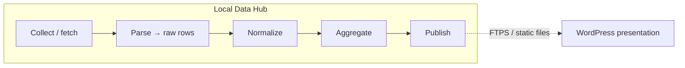

# Project vision and system map

This document orients new contributors and AI agents: **why** OrganicMarketAgent exists, **what** it does end-to-end, and **where** the main pieces live in the repository.

---

## Vision and mission

**MyFarmAgents** is a volunteer-led initiative to build small, focused services for Israel’s organic small-farm community. **OrganicMarketAgent** is the first agent: a **transparent, community-sourced price index** for organic vegetables. It answers a simple question — *what do things roughly cost at the source?* — by aggregating observations from farms, CSAs, farm shops, and farmers markets, without replacing any single seller’s pricing.

**Principles (architecture is aligned with these):**

- **Transparency** — published artifacts explain freshness, source coverage, and (where relevant) pipeline health metrics.
- **No silent magic** — normalization rules and catalog decisions are data-driven and inspectable (DB + admin).
- **Static publish** — the public WordPress site reads **versioned static files** (JSON/HTML); there is **no live API** in V1 between the local hub and the site.

---

## High-level architecture

1. **Collect** — HTTP fetches (and related ingestion) into the database.
2. **Parse** — structured **raw extracted items** (lines still tied to source text).
3. **Normalize** — map lines to catalog products, units, and flags; **scope skip** rules can mark out-of-scope lines as *ignored* with an explicit reason code.
4. **Aggregate** — rolling windows, community-source thresholds, daily/weekly logic per spec.
5. **Publish** — emit `manifest.json`, `public_report-{ts}.json/html`, and maintain fallbacks.

---

## Repository map (where to look)

| Path | Role |
|------|------|
| `organic_market_agent/` | Application package: models, pipelines, admin, publisher |
| `organic_market_agent/admin/` | Local Flask UI (dashboard, catalog tools, runs) |
| `organic_market_agent/publisher/` | Publish engine + public HTML templates |
| `organic_market_agent/db/versions/` | Alembic migrations (schema evolution) |
| `tests/` | Pytest suites |
| `scripts/` | Shell helpers (servers, ops) |
| `data/` | Local data files (e.g. normalizer baseline JSON for before/after metrics) |
| `docs/` | Glossary + legacy/bilingual technical specs |
| `documentation/` | **English** documentation hub for humans and agents |
| `_COMMUNICATION/` | Team reports, roadmap, gates (process, not runtime) |

---

## Main runtime flows

### Ingestion and normalization

- Raw lines live in **`raw_extracted_items`** with statuses such as `extracted`, `normalized`, `unresolvable`, `ignored`.
- The **normalizer** applies DB-driven aliases and rules; **approved scope skips** (`catalog_scope_skip_rules`) run early and set `ignored` + `ignore_reason_code = approved_scope_skip` where appropriate.
- Admin surfaces: dashboard funnel KPIs, **scope-skip catalog** page, maintenance actions (e.g. re-normalize) as implemented in routes under `organic_market_agent/admin/`.

### Publish path

- **`PublishEngine`** builds the public product list (rolling window, min sources, staleness rules).
- Artifacts include **`public_report.json`** (machine-readable index + **`data_quality`** snapshot) and **`public_report.html`** (Hebrew-facing page with a short transparency block).
- **`manifest.json`** duplicates key **`data_quality`** fields for quick consumers.

### Data quality snapshot

- **`organic_market_agent.utils.data_quality_snapshot.compute_raw_pipeline_counts`** — single source of truth for counts shown in admin dashboard, `public_report.json`, and `manifest.json`.

---

## Product and scope boundaries (V1)

- **In scope:** organic **vegetables** in **community** channels; **baskets/CSA** as first-class basket products (not decomposed to per-kg in V1).
- **Explicitly out of scope (examples):** donations, cleaning products, many dry-grocery lines on mixed retail grids — handled via **catalog scope skip rules** after stakeholder approval, not by silently dropping data.

Canonical vocabulary: [`docs/GLOSSARY.md`](../../docs/GLOSSARY.md).

---

## Milestones and process

- Roadmap and gates: [`_COMMUNICATION/ROADMAP.md`](../../_COMMUNICATION/ROADMAP.md).
- **M1–M6 COMPLETE** (G1–G6 all PASS). **M7** (Public Publishing / Go-Live) pending Nimrod approval.
- Pipeline resolution rate: **100%** (0 unresolvable items out of 508 total).
- 67 products, 232 aliases, 301 scope-skip rules, 174 normalized observations, 29 database tables.

---

## System health (as of 2026-03-31)

| Metric | Value |
|--------|-------|
| Resolution rate | 100% |
| Products | 67 (62 with observations) |
| Active sources | 7 of 20 |
| Active aliases | 232 |
| Scope-skip rules | 301 |
| Alembic migrations | 29 (head: 029) |
| Tests | 127 passed, 2 skipped |
| DB check | PASS |

---

## Related documentation

- [`README.md`](README.md) — short overview and pointers.
- [`../02-architecture/`](../02-architecture/) — module boundaries and design notes.
- [`../04-pipelines-and-runtime/`](../04-pipelines-and-runtime/) — step-by-step pipeline behavior.
- [`../05-admin-and-operations/`](../05-admin-and-operations/) — local admin and operations.

---

*Last updated: 2026-03-31.*
