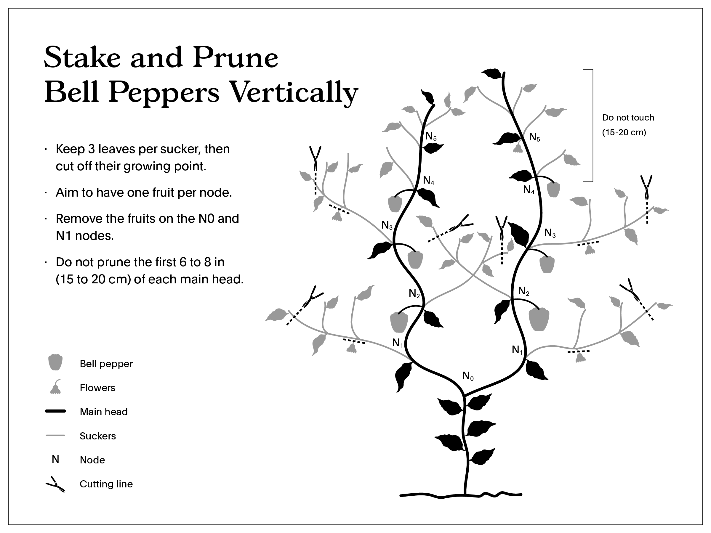
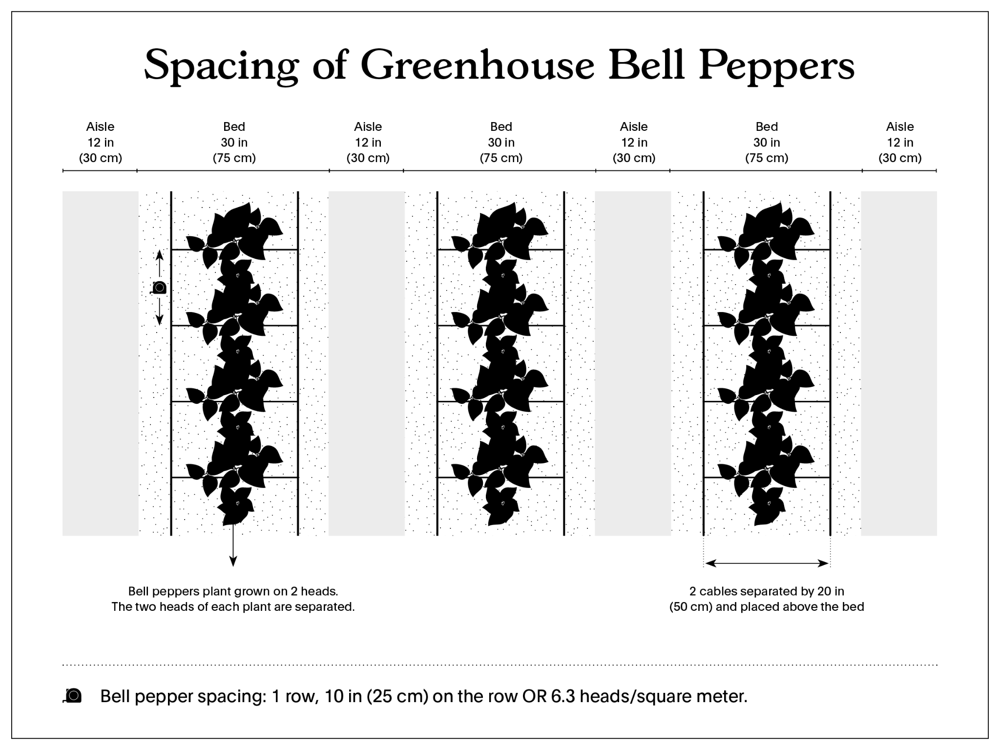

# פלפל חממה (from macBook Air - nimrod)

<!-- Source file: פלפל חממה (from macBook Air - nimrod).PDF -->

<!-- Converted to Markdown. Text is preserved in the source language. -->

<!-- PDF title: FT_editable_Poivron-serre_eng -->

<!-- Page 1 -->

Greenhouse Peppers

Greenhouse Peppers

Greenhouse peppers are a technically challenging crop to grow. After gaining
skill with greenhouse tomatoes and cucumbers it’s a next step into greenhouse
production.

The techniques listed here only concern heated greenhouse production. The
added labor cost of pruning and trellising pepper plants is only worth it in a
context of increased yields made possible by a controlled climate.

In order to succeed in this production, sources of stress for the plant should be
minimized at all levels (climate, irrigation, etc). A stressed pepper plant will be
stunted and will have very low yields. This goal must be kept in mind at every
step of the production.

Family

●
Solanaceae

Cultivars

●
Carmen
●
Ace
●
Sprinter
●
Escamillo

Crop Planning

We plan for only one generation of greenhouse peppers per year. If successful,
this generation remains productive for 6 months or more. Splitting this
production over two generations is more labor intensive and does not generate
more yields, so we limit ourselves to one.

themarketgardener.com
1

<!-- Page 2 -->

Greenhouse Peppers

We seed the greenhouse peppers in January and plan to transplant them at the
same time as the greenhouse tomatoes. Harvest will go on throughout the
summer and early fall. We remove the plants late fall when their productivity
declines and their yields no longer justify the heating costs associated with this
production. Most often, the greenhouse bed space is replaced with frost hardy
crops grown during the winter months.

Starting seeds

●
Start seeds in the nursery 8 to 10 weeks before the transplant. Sow
seeds in 128 cell flats in low fertility soil mix. 1 seed per cell.

●
Place trays on heating mats and maintain floor temperature at 80 °F
(27 °C) until emergence. A plastic dome can be used to help retain
heat and humidity. Remove the dome after emergence.

●
Remove the trays from the heating mats and maintain nursery
temperature between 70 and 75 °F (21-24 °C) during the day and
68-70 °F (20-21 °C) at night. The soil-mix must be kept moist at all
times.

●
Pot-up in 6 in (15 cm) pots with high fertility potting soil,
3 to 4 weeks after sowing, or when seedlings have
developed 2 true leaves. At this point, extra fertilization
can be added (alfalfa meal or/and chicken manure). Add
less than one teaspoon per pot.

●
Around week 5 or 6, decrease by half the amount of
plants per tray in order to give each plant good access
to light.

●
Plants are ready to be transplanted when the seedlings are 8–10
weeks old. They should be 14–18 in (35-45 cm) tall.

themarketgardener.com
2

<!-- Page 3 -->

Greenhouse Peppers

●
If the king flower (the first flower that forms at the node where the
plant first split in 2) has developed, remove it at this point or while
transplanting. The goal at this point is to develop a strong plant
that has the capacity to hold a large fruit load - the seedling is not
ready yet for that task.

Intensive spacing

●
1 row per bed spaced every 10 in (25 cm) on the row.

●
2 heads per plant. Final density is 6.3 heads/m2. See Density Appendix
for explanations.

Fertilization

●
Bi-monthly application of compost (2-1-1), alfalfa meal (2-0-2), feather
meal (11-0-0), Sul-Po-Mag (0-0-22), hen manure (5-3-2) and potassium
sulfate (0-0-50). Follow Greenhouse tomatoes recommendations for
quantities.

●
Perform an EC (electrical conductivity) test every 2 weeks to monitor the
progression of the fertilization. The EC will determine if plants need to be
fertilize or not.

●
Fertilize once on one side of the row, then on the other side 2 weeks
later. The EC test is to be conducted before fertilization on the side that
is meant to be fertilized that week.

Irrigation

Irrigation Type

●
Drip tapes (4 per bed) : Under black & white tarp (white side up).

themarketgardener.com
3

<!-- Page 4 -->

Greenhouse Peppers

Irrigation Management

●
Root depth: Medium (24-40 in or 61-101 cm)

●
General information: Constant and even moisture from flower through
fruit. Peppers like to dry down before being watered again.

●
In hot conditions, imbalances of moisture may lead to blossom
end rot. To mitigate, frequent deep water is critical.

●
Exact amount of water given should be continuously adjusted
throughout the season depending on the amount of light
received, temperatures and stage of growth. These guidelines
should be followed at all time :

○
Schedule 1 to 6 irrigation cycles per day. These cycles should be
done between 9 AM and 2 PM. The general guideline to follow is
to start irrigation 2 to 3 hours after sunrise (giving the plants time
to get active) and stop irrigation 5 to 6 hours before sunset
(avoiding too much water in the rootzone at night).

○
The 9 AM to 2 PM rule can be adjusted, as long as it follows those
principles.

○
We program 3 irrigation schedules on the timer: one each for
sunny, partially sunny and cloudy days. Outside conditions
necessitate different watering cycles in the greenhouse : 3 to 6
per day when sunny, 2 to 3 per day when partially sunny and 1 to
2 per day when cloudy. To manage this, we use a watering clock
with different start times and schedules. The irrigation is adjusted
each morning according to sunrise and sunset times and weather.
It takes only a few seconds a day to adjust the water clock.

●
The length of each irrigation pulse has to be adjusted to ensure that
the plants are getting the right amount of water. A good way to test
this is to sample soil in the greenhouse at the end of the day and first

themarketgardener.com
4

<!-- Page 5 -->

Greenhouse Peppers

thing the next morning—take a handful of soil at each point, and judge
the moisture content. Both should feel about the same.

Implantation

Equipment

●
Shovel
●
Fertilization
●
Hose
●
Irrigation equipment (drip tape)
●
Black & white tarp and anchoring pins

Itinerary

●
BEFORE TRANSPLANTING: Make sure that the steel support wire is
installed and ready to go before you set out your transplants. The bed
layout when transplanting peppers is made of beds of 42 in (1 m) from
center to center—beds are 30 in (75 cm) and pathways 12 in (30 cm).
Every bed is used for plant growth. The peppers are trellised onto 2
wires which run parallel to the center of the 30 in bed. The wire should
be at least 12 gauge. The spacing between those two wires is 20 in (50
cm). The height of the wires is 7 ft (2 m) or higher. See Hardware
Set-Up Appendix for details.

●
Make sure all furnaces are operational, with back-up ready to go. Plan
to measure soil temperatures 2 weeks prior to the transplanting date.
The minimum soil temperature is above 60 °F (16 °C), 20 °C is optimal.
If too cold, cover beds with clear plastic—a few sunny days will help
warm up the soil. Starting the furnaces in the greenhouse might also be
necessary. In cold climates, installing radiant floor heating (PEX tubing
buried 18 in (45 cm) in the ground + simple household hot water tank)
is another solution.

themarketgardener.com
5

<!-- Page 6 -->

Greenhouse Peppers

●
During those 2 weeks, it is also good practice to flood the soil of the
greenhouse with 1–2 inches (2–3 cm) of water. This can be done by
irrigating with drip tapes or sprinklers. This slowly penetrating water will
flush out salts (left from fertilizers over previous years) and increase the
conductivity of the warming soil.

●
AT TRANSPLANT: Using a shovel, dig a trench 8 inch deep in the middle
of your bed. Each plant will be spaced 10 po (25 cm) on the row, so dig
up accordingly.

●
Apply compost and amendments in the trench and fill up with water. The
soil needs to be mucky wet.

●
Transplant peppers making sure to extract the seedlings from their pots
delicately. When putting them in the ground, the clump should end up
being level with the soil. Make sure the rest of the bed surface is level for
uniform irrigation.

●
Once the plants are in the ground, tie up each one with a clip placed
under the first V (where the plant branches out in two). To maximize
productivity, prune off the first flower located at the first node. This step
will give the plant time to establish before it has to mature fruits.

●
Install 4 lines of drip tape per bed, but activate only the 2 closest to the
plants for 2-3 weeks or until the roots are well established. This way,
fertilization that the plant roots cannot yet reach is not leached. Water
the bed thoroughly the first time, keeping the soil moist for the first week
after the transplant.

●
Lay down the black & white tarps between the rows. Put the white side
up and the black side toward the soil. Secure the plastic with staples
each second step (5 ft or 1.5 m).

●
Install one heating tube per aisle. For the first week after transplant, set
the ambient temperature at 73 °F (23 °C) during the day and 70 °F (21
°C) at night to encourage vegetative growth and root retake.

themarketgardener.com
6

<!-- Page 7 -->

Greenhouse Peppers

●
If root retake is going well, change temperatures to 70-75 °F (21-24 °C)
during the day and 65-68 °F (18-20 °C) at night in order to start fruit
production. If not, wait another week before doing this.

Pruning and trellising

Greenhouse peppers plants are fast growing and must be trellised and pruned in
order to ensure a steady harvest and correct the flushy character of pepper
plants. This is done every other week, isn't complicated, but takes time to
master. Make sure that employees have a good understanding of peppers'
growing pattern.

Peppers are branching plants, with each division leading to 2 new heads. The
rules of their pruning process are :

●
Choose two main heads and treillised them toward each side of the bed.
Trellising is done by using a clip and this step is performed every two
weeks.
●
Keep one fruit on each node of the two main heads
●
Keep three leaves per sucker before clipping off their growing tip
●
Leave no fruits on suckers

It is important to keep leaves on suckers, because they act as solar panels
which provides more photosynthesis potentiel to the fast growing plant while
also protecting fruits from the sun (peppers fruits are prone to sunburn).

This selective pruning starts a few weeks after transplant, or when the plant has
more than 2 nodes. See diagram. Before then, all flowers should be removed in
order to let the plant establish its roots.

Six or seven weeks before the last desired harvest, prune off the heads above
the last set fruit on every plant. This will give the plant the chance to
concentrate its energy on maturing its last fruits. The last fruits left on the plant
can also be sold green.

themarketgardener.com
7

<!-- Page 8 -->

Greenhouse Peppers

Climate management

●
When the plants have reached a full load of fruits, change temperatures
to 70-73 °F (21-23 °C) during the day and 63-64 °F (17-18 °C) at night.
While doing this, remember to avoid any sudden temperature change.
Temperatures should never vary more than 2 °F (1 °C) per hour.

●
Avoid night temperatures above 68 °F (20 °C) (peppers have difficulties
setting fruits at those temperatures), unless plants have already set
enough fruits.

●
Aim for a 24h temperature of 70-72 °F (21-22 °C).

themarketgardener.com
8

<!-- Page 9 -->

Greenhouse Peppers

●
Avoid temperatures below 60 °F (16 °C) or above 82 °F (28 °C), since
these two extremes can lead to the plants shutting off. Very high
temperatures also lead to infertile pollen.

Weeding

●
No weeding required due to the use of white plastic tarps between the
pepper rows.

Plant protection

●
Young pepper plants are susceptible to aphids. Introduce ladybugs or
Aphidius Colemani. If the situation is leaning towards infestation, spray
your plants with insecticidal soap one day before introducing your
beneficials. Please refer to the Beneficial greenhouse insects module for
more information.

●
If plants are flowering but fail to set fruit, the culprit (at least in northern
regions) is likely to be the tarnished plant bug, which particularly
appreciates the sap of eggplant and pepper flowers. In the case of an
infestation, the use of a biopesticide might become necessary.

●
To counter blossom-end rot (a physiological disorder usually related to
calcium deficiency and irrigation), water abundantly during the
fruit-formation period and especially during the fruit-maturation period.
Aim for up to 1 in (2.5 cm) water/day. In case of rapid degradation, or to
prevent the problem, spray your plants twice a week with calcium
chloride. If all fails, fertigate the calcium directly in your drip system.
Note that the Escamillo and Carmen cultivars are more sensitive to
blossom end rot than other peppers.

themarketgardener.com
9

<!-- Page 10 -->

Greenhouse Peppers

Pollination

The use of bumblebees for pollination in peppers production is recommended
in order to obtain maximum yields and larger fruit size, but it’s not essential
since pepper flowers are self-fertile.

Bumblebee hives have to be replaced throughout the season, following the
supplier recommendations. In the event of a low pollination rate, the hives can
be replaced. Also, if the bumble bees become aggressive, they can be feeded
by adding half a spoon of pollen on the screen above the hive.

Harvest

The first fruit will be ready to harvest when the plant has set approximately 5
fruits/head. A first harvest can be anticipated 2 to 2.5 months after transplant,
depending on temperatures and light.

Harvest is done twice a week using a pruner and a tree planting bag. It is
preferable to cut the fruit peduncle close to the stem in order to avoid creating
an entryway for diseases.

Peppers are ready to harvest when they are firm, large and 80% and + rippen
(ie. fully colored). They will reach full color in storage or at the client's house.
This harvesting technique ensures a longer shelf life.

Only peppers that are free of blemishes are harvested. The rest are picked and
discarded in the pathways. It is important to take the time to remove those bad
peppers since they act as energy sinks on the plants.

Note that fruits with blossom end rot are an exception at the beginning of the
season. They must be left on the plants until those have reached a full fruit load.
This technique ensures that the blossom end rot does not spread to the other
fruits on the plant. From that point going forward, the best practice is to remove
any pepper with blossom end rot immediately.

themarketgardener.com
10

<!-- Page 11 -->

Greenhouse Peppers

Conditioning

●
Peppers are not washed but must be wiped clean if dirty.

●
In the event of an important aphid or white flies infestation, peppers can
be washed in the bubbler to get all the honeydew and fumagine off the
fruits.

Storing

●
Peppers are stored in a cold room kept at +/- 54 °F (12 °C) and should
not be stored for more than 4 days before being sold.

themarketgardener.com
11

<!-- Page 12 -->

Greenhouse Peppers

Appendix 1: Calculating plant density

When growing peppers with more than one leader (head), it’s misleading to
understand density only in terms of in-row spacing. In greenhouse production
language, density is measured by calculating the surface area that is planted
and multiplying it by a density target, measured in square meters. (1 m = 3.2 ft).
Common density targets for greenhouse peppers range from 6 to 7 head/m2.

Peppers example:

●
Our pepper greenhouse is 10 X 30 m so 300 m2

●
Following our bed set-up, peppers are planted on every bed, which
allows for 8 beds to be planted in that area.

●
Aiming for a head density of 6,3 heads/m2, we multiply the surface area
by the target; 300 m2 X 6,3 heads/m2 = 1890 heads. 1890 heads = 945
plants (2 heads per plant) on 8 beds, thereby equating to 118 plants/bed.
Beds are 1181 in (30 m) long, divided by 118 plants, peppers need to be
spaced out this way : one plant every 10 in (25 cm).

themarketgardener.com
12

<!-- Page 13 -->

Greenhouse Peppers

Appendix 2 : Hardware set-up

themarketgardener.com
13

