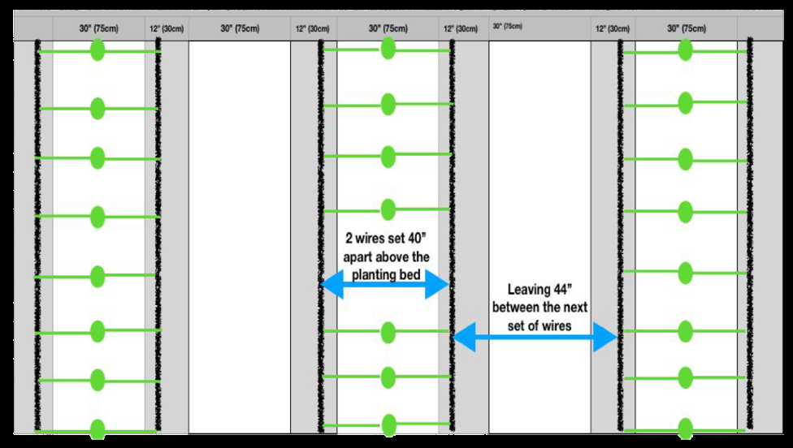
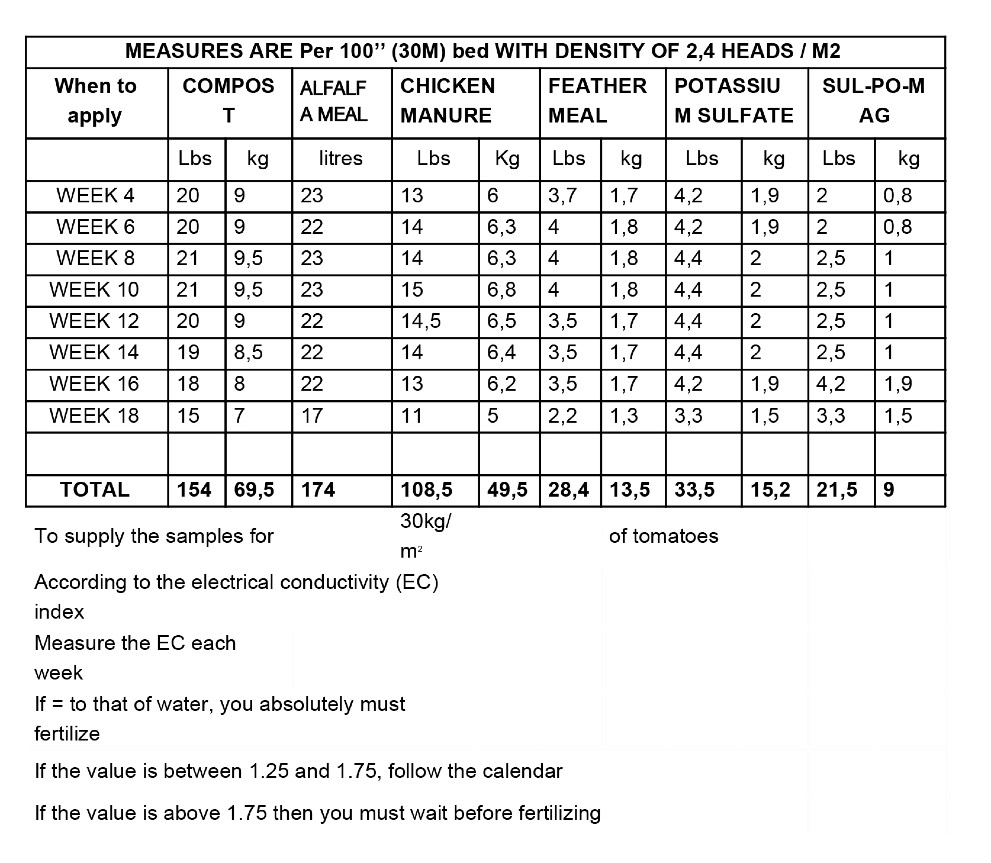
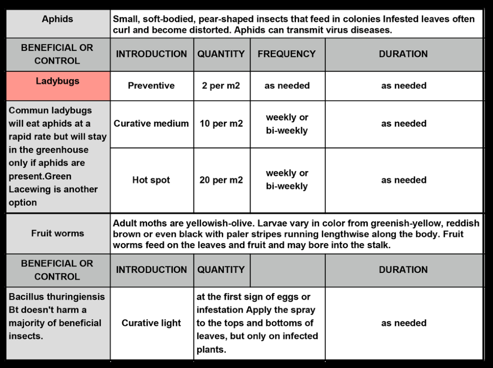
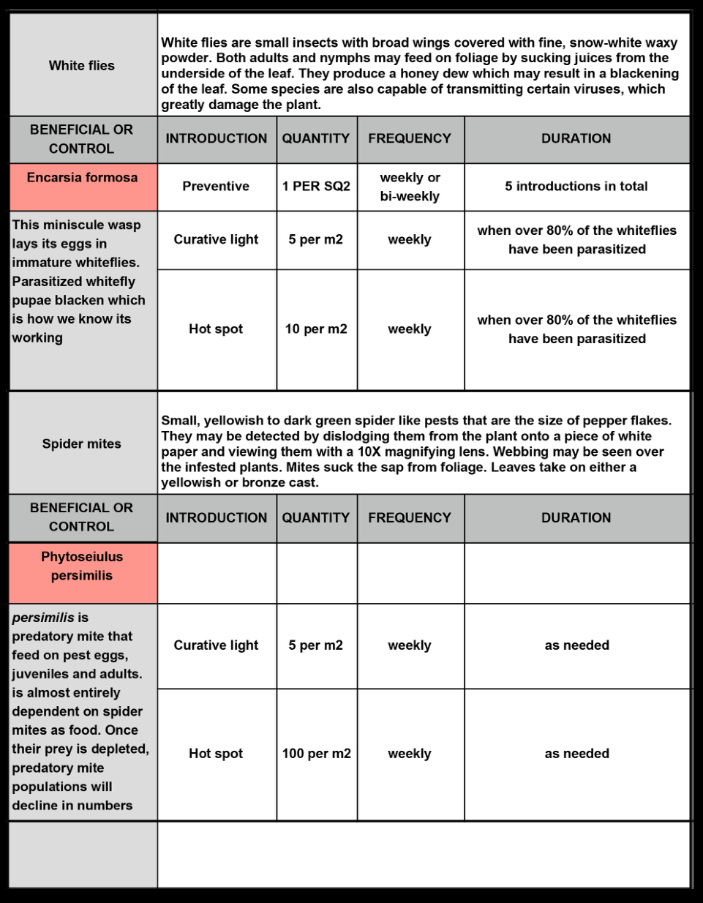

# עגבניות חממה (from macBook Air - nimrod)

<!-- Source file: עגבניות חממה (from macBook Air - nimrod).PDF -->

<!-- Converted to Markdown. Text is preserved in the source language. -->

<!-- PDF title: Tomatoes.pages -->

<!-- Page 1 -->

Greenhouse Beefsteak Tomatoes

CULTIVARS

• Marnero
• Marbonne
• Margold
• Beorange
• Aurea
• Bigdena
• Trust
• Maxifort (rootstock)

INTENSIVE SPACING

• 1 row per bed spaced every 13” (33 cm) on the row.

• These are indeterminate plants with 2 vines per plant, each lowered and leaned on

its own support wire. Final density is 2.4 heads/m2. See Density Appendix for
explanations.

FERTILIZATION

• Bimonthly application of compost (2-1-1), alfalfa meal (2-0-2), feather meal (11-0-0)

Sul-Po-Mag (0-0-22) and potassium sulfate (0-0-50). See Fertilization Appendix for
details.

• Perform an EC (electrical conductivity) test every 2 weeks to monitor the

progression of the fertilization. The EC will determine if we need to fertilize or not.

• We fertilize once on one side of the row, then on the other side 2 weeks later. The

EC test is to be conducted before fertilization on the side that is meant to be
fertilized that week.

GREENHOUSE TOMATOES
THE MARKET GARDENER’S MASTERCLASS
"1

<!-- Page 2 -->

STARTING SEEDS

• Start the seeds for rootstock and the plants to be grafted at the same time. Grafting

adds 10 days to the normal number of days required when sowing seeds in cell flats
i.e. +/- 60 days.

• To start we use 72-cell trays and the best available organic potting mix (ideally one

inoculated with mycorrhizae). Place trays on heating mats and maintain floor
temperature at 27 °C (80 °F) until emergence.

• After emergence, maintain the ambient temperature at 20 °C (68 °F) day and night.

The soil must be kept moist at all times. Humidity must be constant and the mist
nozzle should be used for watering.

• Seedlings will be ready to be grafted within +/- 4 weeks after sowing. The stems

should have reached approximately 1 mm in diameter by then. For grafting, see
Grafting Procedures Appendix.

• When the graft is done and plants look solid (+/- 4 weeks after sowing), the plants

are potted up in 6” (10 cm) pots. Then we put 3 pots per tray so they are well spaced
out on the seedling tables.

• At that point, the plant has two or three good leaves, we pinch off the main leader in

order to produce two heads.

• From then on, watering the seedlings will always be done using the BLUE nozzle

(400 perforations). It is important to let the soil dry between waterings in order to
prevent moisture problems. With the BLUE nozzle, waterings are less frequent, but
of longer duration. Do not water after 2 pm (spring) and 4 pm (summer).

TRANSPLANTING AND SET-UP

Our tomato greenhouse is not spaced in a “normal” way, given that we also use it to
grow field crops in the winter months. Our greenhouse is set up in beds of 42” (1.1 m)
from centre to centre. Beds are 30’’ (75 cm) and pathways 12’’ (5 cm).

When transplanting, every second bed is planted with tomatoes while the other is
planted with another quick growing crop (turnips, salads, etc.). We time the
successions so that these beds get cropped out 6 weeks after the tomatoes have
been transplanted. Once the latter have been harvested, those beds become
pathways for harvesting tomatoes.

GREENHOUSE TOMATOES
THE MARKET GARDENER’S MASTERCLASS
"2

<!-- Page 3 -->

We plant in tight single rows and the plants are trellised in a “V” shape (one on the
right, one on the left) so the heads get a maximum of light.

BEFORE TRANSPLANTING: The trellis infrastructure is crucial to success with the
lower and lean method that we use. You will need to suspend strings from a support
system of wires that runs parallel to your beds. The steel wire should be at least 12
gauge and will need to be installed prior to planting, in order to avoid disturbing the
plants once they are established. The hardware for this set-up is 2 wires 40’’ (1M) that
run parallel to our 30’’ beds, then leaving 44’’ (1,2M) feet for a walkway until the next
set of wires. The height of the wire is 8’ (2,4M). See Crop Spacing and Hardware Set-
Up Appendix for details.

For rapid take off of young tomato plants, 2 conditions need to be in place; the
temperature in the soil should be above 67 °F (19 °C) and the ambient temperature
(day and night) should be at 73 °F to 77 °F (23 °C to 25 °C) to encourage vegetative
growth and root retake.

Make sure all furnaces are operational, with back-up ready to go. Plan to measure soil
temperatures 2 weeks prior to the transplanting date. If too cold, cover beds with
clear plastic—a few sunny days will warm up the soil. In cold climates, installing radiant
floor heating (buried PEX tubing 18’’ in the ground + simple household hot water
tank) is another solution.

During those 2 weeks, it is also good practice to flood the soil of the greenhouse with
1–2’ of water. This slowly penetrating water will flush out salts (left from fertilizers from
previous years) from the soils. This will also increase the conductivity of the warming
soil.

WHEN TRANSPLANTING:

• Broadfork the beds.

• Mark the spacings every 13”, then dig the holes using a round shovel (+/—7”

diameter).

• Add some compost in each hole and a handful of chicken manure (5-2-1) or other

fast acting balanced natural fertilizer. Then, fill the hole with water using a hose. The
mixture should become a muddy matter.

GREENHOUSE TOMATOES
THE MARKET GARDENER’S MASTERCLASS
"3

<!-- Page 4 -->

• Align tomato seedlings in front of each hole, making sure not to mix up the cultivars.

Start by delicately extracting the seedlings from their pots and placing them gently
into the hole. The soil level on the seedling should end up being quite level with the
soil.

• The most important is that no soil be close to the graft, as we do not want the graft

to take root—any soil that’s touching the plant above the graft line will encourage
rooting, and thus increase the risk of soil-borne disease.

• Our plants have 2 heads. When transplanting, the strongest (largest) of the two

heads must be placed towards the north side of the greenhouse. The weaker of the
two heads will benefit from the additional sun on the south side, and will eventually
catch up to the other.

• Install 4 drip tape lines, but activate only the 2 closest to the plants. This way, we

avoid over-mineralizing the rest of the bed and are keeping the “pantry” abundant
for another few weeks. See Irrigation Schedule Appendix for watering
adjustments.

• Install the heating tubes in the pathways and start the ambient heating. For 7 days

after transplanting, maintain a constant temperature (day and night) of 73 °F to
77 °F (23 °C to 25 °C). This will encourage vegetative growth and root retake.

ONE WEEK AFTER TRANSPLANT, it’s time to trellis each of the 2 heads of the plants.
This is done by connecting them to a string attached to the wires that runs across your
bed. We use the double tomato hook with white twine recommended for greenhouse
production (avoid using anything biodegradable, as it might break down during the
season).

• Install wire hook every 13’’ (33 cm) on each of the wires, leaving enough string to

reach the bottom of each plant with some slack.

• Using a clip, attach the string just above where the first 2 leaders branch.

• Use 2 bamboo sticks (one for each head) to stretch the plant on towards the wire,

making sure not to break the plant at the junction of the two heads.

• Install metal supports every 5’ (1,5M) underneath each of the 2 wires.

GREENHOUSE TOMATOES
THE MARKET GARDENER’S MASTERCLASS
"4

<!-- Page 5 -->

BEFORE WEEK 3: Install venting tubes inside the beds placing them on the metal
supports. Let them ventilate 24/7, which helps with air flow in the crop. This is done by
wiring the blower of your furnace to always run.

• Open the 2 outside drip tape lines, bringing the total to 4 drip tape lines per

30’’ (75 cm) beds.

BEFORE WEEK 6, or whenever the veggies between the tomato beds are cropped
out, install UV treated tarps between rows. This will keep weeds in check and help the
biological activity in the soil. See Appendix 5 for details

PRUNING, SUCKERING & TRELLISING

Pruning suckers can begin once the first flower cluster has developed, and should
continue throughout the crops’ development. To avoid the possible spread of plant
diseases, prune only when foliage is dry, and sanitize your hands and tools before
each time.

It is easiest to prune suckers by hand while they are still small (about 1’’-2.5 cm). For
this reason, we prune every week, preferably in the morning, in order for the wound
to heal itself during the day. Larger suckers leave a larger wound, which can be
invaded by pathogens and may require pruning shears to avoid damaging the stems
when removed. See video tutorial for example of how to prune efficiently using both
hands.

The pruning of each plant is always done simultaneously with the trellising of the
plant, making it grow towards the wire. We prefer winding the plant around the string,
instead of using clips to the trellis. It is faster and eliminates having to carry around
material requiring manipulation. It also somewhat stresses the plant, which is positive
from a production point of view.

Both pruning suckers and winding the plant are performed before moving on to the
next plant. Be sure to wrap the string in the same direction each time.
Additional clips should be placed every 48’’ (1,2M) on the stem, for extra strength as
the plant grows.

Pruning and winding the plants will take less time overall if done every week when
suckers are smaller.

GREENHOUSE TOMATOES
THE MARKET GARDENER’S MASTERCLASS
"5

<!-- Page 6 -->

PRUNING LEAVES

Similar to removing suckers, pruning leaves allows the plant’s energy to go toward
fruit production, instead of maintaining excess vegetative growth. Removing the
lower leaves also increases airflow, which can reduce the incidence of disease. As with
pruning suckers, it is best done early in the morning and only when the foliage is dry,
in order to avoid the potential spread of disease.

• Once the plants have approximately 18–20 leaves, begin removing 1–3 leaves each

week using both of your hands. The leaves most appropriate to remove are those
on the lower parts of the plant that may be shaded or crowded. Additionally, if you
see any leaves that appear diseased, remove these and dispose of them.

• Leaves left on the ground are removed using a broom when all other tasks have

been completed.

LOWERING AND LEANING

• Once the plants have reached the top of the wire, we lower and lean them to one

side, allowing them to continue growing and extend production.

• To lower and lean a plant, hold the string and the weight of the plant in one hand,

release about 1 foot length of string from the hook and move the plant over one
position before reattaching to the wire.

• Continue down the row until you reach the last plant, which can be hooked to the

wire in the neighbouring row. As the season progresses, the plants may need to be
lowered and leaned multiple times. Always lean the plants in the same direction.

Lowering and leaning is the last step we do when doing all 3 operations in a given
day, in addition to fertilizing which is done every second week:

1. Prune suckers and wind the plants
2. Prune excess leaves
3. Lower and lean plants

When the plants are tall, suckering and winding is done when lowering the plants in
order to move climbing ladders only once. In all instances, carry clips to indicate any
anomaly.

GREENHOUSE TOMATOES
THE MARKET GARDENER’S MASTERCLASS
"6

<!-- Page 7 -->

5 weeks prior to the last harvest date, top the head of each vine, allowing for the
plant to put all its energy in ripening the last fruits.

CLIMATE MANAGEMENT

• 7 days after transplanting, maintain a constant temperature (day and night) of 73 °F

to 77 °F (23 °C to 25 °C) to encourage vegetative growth and root retake

• The 4 following weeks and before the plants are heavy with fruit, maintain

temperatures around these values: daytime 75 °F (24 °C) and nighttime 64 °F
(18 °C).

• For the remainder of the season, temperatures are adjusted according to available

sunlight, independent of outside temperature. In the greenhouse, sunlight is the
limiting factor for optimal growth. On sunny days, plant will grow more, and you
want to give them more heat and inversely, when it's cloudy you want to give less
heat to halt the growth.

• For this reason, it is important to adjust temperatures daily according to whether

you’re expecting a sunny day, a cloudy one or a mix of both. The day temperature is
adjusted according to the forecasted available sunlight and the night temperature is
a function of the sunlight received on the previous day. The difference between day
and night temperature shouldn’t be greater than 40 °F (4 C). The changes in
greenhouse temperature should not go faster than ± 34 °F (1 C) per hour.

• We also adjust the temperatures to encourage either the plants’ vegetative or its

fruit growth. To do so, one must understand the 4 key periods of climate
management (found in Appendix) as well as the growth phases (Appendix).

IRRIGATION

The overall idea is to know how to properly water the soil according to the plants’
needs, timing both the plants’ growth stage and the daily.

We use 3 irrigation cycles which are programmed on the timer: sunny, partially sunny
and cloudy.

GREENHOUSE TOMATOES
THE MARKET GARDENER’S MASTERCLASS
"7

<!-- Page 8 -->

Watering is split into different cycles:

• 6 per day when sunny
• 4 per day when partially sunny
• 2 per day when cloudy

 To manage this, we use a watering clock with different start times and cycles. The
irrigation is adjusted each morning according to sunrise and sunset times. It takes
only a few seconds a day to adjust the water clock.

All cycles begin when the plants are active (3 to 4 hours after sunrise) and stop in the
afternoon, earlier or later depending on sunset. The length of each irrigation pulse
has to be adjusted to insure that the plants are getting the right amount of water. A
good way to know this is to sample soil in the greenhouse at the end of the day and
the first thing the next morning. When taken a handful of soil, both should feel pretty
much the same.

To sync the water needs of the plant with growth stage, we follow an irrigation
calendar and temperature calendar. See Greenhouse Control Appendix.

WEEDING

Crop is kept clean by occasional hand weeding in the row and by covering the soil
with UV treated plastic tarps between the rows. See Tarp Appendix for details.

PLANT PROTECTION

Pest control is a major part of any greenhouse operation. How to deal with the
problem will depend on many different variables, but prevention and observation
should be your primary tools. The aim is to favor a plant positive approach to pest
management avoiding using pesticides and working with predatory insect
introduction instead. It’s the way to go, but it requires some preparation and advance
planning. See Beneficials Appendix for solutions.

The first step is identifying the insect and applying the recommended control if one
exists. Sticky tape can also help reduce insect pressure and is helpful in identifying
insects.

GREENHOUSE TOMATOES
THE MARKET GARDENER’S MASTERCLASS
"8

<!-- Page 9 -->

Another important practice is eliminating habitats suitable for insect survival. You do
this by completely removing plant residues that could provide an overwintering
habitat once the crop is done at the end of the year.

Diseases are also very context-dependent. The first lines of defence against disease in
the greenhouse are to graft your tomato plants, use cultivars that are disease resistant
and control humidity levels in the greenhouse. Removing sick plants and cleaning
your hands and tools is also vital in protecting against bacterial or viral infections. For
anything specific, a good resource guide is your best bet.

POLLINATION

Introducing bumblebee hives every 12 to 16 weeks is a very effective way to insure
pollination. The bumblebees have the advantage of visiting flowers at the exact right
moment. Tracking the percentage of pollinated flowers will allow you to assess hive
health. Too much pollination can damage the flowers and the fruits, if that happens,
the opening of the hive has to be controlled trapping the bumblebees inside and
reducing their activity. It’s also important to make sure the bumble bees have enough
to eat. Commercial hives come with instructions about all of this.

If you aren’t purchasing pollinating hives, “self-pollination” can also be assured by
tapping the overhead wires daily. Making a routine out of it, you simply go down each
row tapping the wire with a broomstick. The best time to do this is between 11 and
12 AM.

HARVEST

Harvest is conducted twice a week. Only the ripe fruits are harvested and we leave the
calyx (the little green hat at the stem of the fruit) on. We use clippers to separate the
fruit from the plant, cutting as close to the fruit as possible. The goal is to cut the stem
as close as possible to the tomato in order prevent the stems from damaging the
other fruits during transport or in market piles. We harvest tomatoes in tomato crates,
up side up unless the variety is very fragile. All damaged or split fruit is put aside
during harvest.

STORAGE

Tomatoes are stored in cold room kept at +/— 46F (8C).

GREENHOUSE TOMATOES
THE MARKET GARDENER’S MASTERCLASS
"9

<!-- Page 10 -->

APPENDIX 1: CALCULATING PLANT DENSITY

When growing tomatoes with more than one leader (head), it’s misleading to
understand density only in terms of in-row spacing. In greenhouse production
language, density is measured by calculating the surface area that is planted and
multiplying it by a density target, measured in square meters. (1 meter = 3.2 feet).
Common density targets for beefsteak tomatoes range from 2.5 to 3.5 head/m2. For
cherry tomatoes, the density target is 4 head/m2.

Beefsteak tomato example:

• Our tomato greenhouse is 10M X 30M so 300 m2

• Following our bed set-up, tomatoes are planted every other bed, which allows for 4

beds to be planted in that area.

• Aiming for a head density of 2.4 heads/m2, we multiply the surface area by the

target; 300 m2 X 2.4 heads/m2 = 720 heads. 720 heads = 360 plants (2 heads per
plant) on 4 beds, thereby equating to 90 plants/bed.

• When transplanting, there are 90 plants/30 metres, meaning 3 plants/bed meter or

1 plant every 33 cm (13”).

Cherry tomato example:

• Our tomato greenhouse is 10M X 30M so 300 m2

• Following our bed set-up, tomatoes are planted every other beds which allows for 4

beds to be planted in that area.

• Aiming for a head density of 4 heads/m2, we multiply the surface area by the target;

300 m2 X 4 heads/m2 = 1200 heads. 1200 heads = 600 plants (2 heads per plant)
on 4 beds, thereby equating to 150 plants/bed.

• When transplanting, there are 150 plants/30 metres, meaning 5 plants/bed meter or

1 plant every 20 cm (8”).

GREENHOUSE TOMATOES
THE MARKET GARDENER’S MASTERCLASS
"10

<!-- Page 11 -->

APPENDIX 2: CROP SPACING AND HARDWARE SET-UP

Our greenhouse is set up in beds of 42” (1.1 m) from centre to centre. Beds are
30’’ (75 cm) and pathways 12’’ (30cm). We plant in tight single rows and the 2 headed
plants are tutored in a “V” shape (one to the right, one to the left) so the heads get a
maximum of light.

The hardware for this set-up is two steel wires (minimum 12 gauge) set 40’’ (1M) apart
above our 30’’ beds, then leaving 44’’ (1,2M) for a walkway until the next set of wires.
When transplanting, every second bed is planted with tomatoes, while the other is
planted with another quick growing crop (turnips, lettuce, etc.). We time these
successions so that these beds get cropped out 6 weeks after the tomatoes have
been transplanted. Once the latter have been harvested, those beds become
pathways for harvesting tomatoes.

GREENHOUSE TOMATOES
THE MARKET GARDENER’S MASTERCLASS
"11

<!-- Page 12 -->

APPENDIX 3: FERTILITY

Here is an example of a fertility calendar that we have used in the past. The organic
fertilizers and amount will vary depending on your soil type, condition and growing
areas, but all numbers should be based on plant requirements.

GREENHOUSE TOMATOES
THE MARKET GARDENER’S MASTERCLASS
"12

<!-- Page 13 -->

APPENDIX 4: CLIMATIC REQUIREMENTS OF TOMATOES

Tomatoes are sensitive plants. They can withstand minimum and maximum
temperatures of 41 °F (5 °C) 95 °F (35 °C) for a few hours only, before they shut down
fruit production.

The optimal thermal regime is 64 °F (18 °C) to 75 °F (24 °C) during the day and 61 °F
(16 °C) to 68 °F (20 °C) at night.
The difference between the day and night average temperatures should be between
34 °F (1 °C) and 39 °F (4 °C).

Temperature below 50 °F (10 °C) will slow down or even stunt growth and
development.

If we look at the average temperature over a 24-hour period (T°24 h), the optimal
range is between 63 °F (17 °C) and 72 °F (22 °C). Outside this comfort zone, the
tomatoes’ fruit productivity and quality are severely affected.

As for humidity, the optimal rate is between 65% and 80%. An environment that is too
humid will lead to problems related to fungal disease and to poor floral fertilization.
Excess or lack of humidity will strongly influence crop productivity.

To produce regularly, tomatoes need a great amount of light. In greenhouses where
the climate is temperate, tomatoes will grow faster in summer when daylight lasts 17
to 18 hours, compared to fall when daylight decreases to 12 hours and less.

GREENHOUSE TOMATOES
THE MARKET GARDENER’S MASTERCLASS
"13

<!-- Page 14 -->

APPENDIX 5: DAILY CLIMATE CONTROL

Temperature control is the greenhouse growers primary tool for adjusting the rate of
development according to global solar radiation and acts on the balance between
the vegetative and generative growth. By playing with day and night temperature
settings, we can steer the plant in a given direction.

Daytime temperature: Day To has an effect on cell elongation. A warm day to
produces longer internodes and longer leaves. By decreasing this temperature, the
opposite effect will be achieved. For the first part of the day, from sunrise until 9 or 10
o’clock, avoid excessively hot temperatures which will cause wilting. Overall, the
optimal temperature for photosynthesis is 72 °F (22 °C) + 36 °F (2 °C).

Night temperature acts mainly on setting and respiration. The optimal temperature
for setting is 64 °F (18 °C) ± 34 °F (1 °C). Night temperature is more often used to
balance the desired T°24h. Furthermore, the night T° is set according to the gap
required with the day T°. A large gap promotes the generative character, while little or
no gap encourages vegetative growth.

Average 24 hour temperature: It influences the speed at which new flower bunches
and leaves are formed. It also acts on the speed of growth and the ripening of the
fruit. T°24h affects the speed of fruit growth. Its increase over a sufficiently long
period will accelerate fruit growth, but will lead to a decrease in fruit size.

GREENHOUSE TOMATOES
THE MARKET GARDENER’S MASTERCLASS
"14

<!-- Page 15 -->

APPENDIX 6: GROWTH PHASES OF THE TOMATO PLANT

Phase 1 lasts about 15 days and is characterized by intense cell division. It is the
phase where the growth potential of the fruit is determined according to the number
of cells formed.

Phase 2 is the stage of rapid fruit growth. The fruit changes from the size of a small
pea to its almost final size: the mature green stage. This is the cell enlargement phase.
Depending on the climatic conditions and the balance between generative and
vegetative growth, this is where the latent quality potential generated during the first
step will more or less be actualized. It is also during this phase that the sugars will
build up in the fruit. It lasts between 30 and 35 days.

Phase 3 is the maturation phase. This is the stage where the mature green fruit
transforms into ready-to-eat red tomatoes. It is the stage where all the biochemical
transformations inside the fruit determine its flavour profile. Depending on the
climatic conditions, it takes 6 to 10 weeks to obtain mature fruit from the time of
setting.

GREENHOUSE TOMATOES
THE MARKET GARDENER’S MASTERCLASS
"15

<!-- Page 16 -->

APPENDIX 7: WHY PUT WHITE PLASTIC ON THE GROUND?

In organic production, we grow tomatoes right in the soil. We feed the soil using
organic fertilizers (compost, wood chips, feather flour, alfalfa flour, hen manure).
These products need to be digested by the soil’s fauna and the flora (earthworms,
woodlouse, fungi and bacteria) for their minerals to be freed and made available to
the plants, carried by the soil’s water. The tomato plants then absorb this water
charged with vitamins to nourish their tissues (stems, leaves, fruit, roots), and to stay
healthy and productive.

We depend on the soil’s fauna and the flora to feed our crops. If all the critters
manage to function, develop and reproduce the way they should, the tomato plants
will obtain all the nutritional elements they need to grow.

We can apply tons and tons of composts and other organic fertilizers to the soil, but if
the fauna and flora don’t have the right conditions allowing them to carry out their
work, the minerals will never be made available to the plants. They will end up having
small stems, small clusters and aborted fruit, meaning fewer tomatoes to harvest and
to sell.

So what exactly are the conditions which bring utter joy to all these little critters?
Moisture, darkness and a steady supply. The tarp helps keep the fertilizers moist and
the soil dark so that the earthworms, woodlouse and other critters may gather to feed
24 hours a day within the soil. That is why the plastic has a black surface.

On the flip side, its white surface serves to increase light reflection onto the plants,
thereby encouraging photosynthesis.

GREENHOUSE TOMATOES
THE MARKET GARDENER’S MASTERCLASS
"16

<!-- Page 17 -->

APPENDIX 8: BENEFICIAL INSECTS FOR ORGANIC CONTROL

GREENHOUSE TOMATOES
THE MARKET GARDENER’S MASTERCLASS
"17

<!-- Page 18 -->

GREENHOUSE TOMATOES
THE MARKET GARDENER’S MASTERCLASS
"18

<!-- Page 19 -->

APPENDIX 9—GRAFTING

Grafting tomatoes is part of what allows us to plant tomatoes in the same place year
after year without running into problems with soil borne diseases. By developing the
root system of the plant to be a lot more vigorous, the grafted tomato will produce
more yields, and thus more production per square feet. If you’re planning on growing
greenhouse tomatoes seriously, it’s a no brainer (and it’s also not difficult!).

Material needed

• Rootstock seeds
• Grafting seeds
• Soil
• Cell packs
• Disinfectant or 1:10 bleach solution
• Razor blades or grafting knives
• Silicone grafting clips of various sizes (1.3 mm [20%], 1.6 mm [60%] and 2.1 mm

[20%])
• Spray bottle
• Humidifier or plastic dome lids

When grafting, the calendar must allow for two extra growing weeks and one more
week if doubling the leads by pruning the seedlings.

Choice of Rootstock

For our large tomatoes that will be in ground for more than 6 months, we’ve used
Maxifort with success, but other vigorous, vegetative rootstock should work just as
well.

Sowing

Sow seed 6–8 weeks before your desired transplant date. Grafted tomato plants take
1–2 weeks longer to reach the transplant stage, because they stop growing during the
healing process—you’ll need to factor this in to your seeding calendar. Overseed by at
least 25% more than the number of plants you plan to transplant. That safety factor is
important to counteract any mortality that might occur in the grafting process.
Good germination is ensured by maintaining soil temperature at 27 °C. Germination
should begin after 3–4 days. We use heating mats with a soil probe to achieve this
optimal condition.

GREENHOUSE TOMATOES
THE MARKET GARDENER’S MASTERCLASS
"19

<!-- Page 20 -->

Once the seeds have germinated, after about 10 days, we reduce the soil
temperature of heating mats to 64–66°F (18–19°C) to encourage a stocky growth
habit.

NB. When grafting eggplants, eggplants need to be seeded earlier than their
rootstock. We sow the rootstocks for these eggplants once the grafts begin to
emerge—approximately 1 week later.

Preparing the graft

• Plants will be ready for grafting approximately 17 to 21 days after being sown. The

best way to know if the plants have reached the right size is to place a grafting clip
around the stem. The clip must be well-adjusted.

• At this point, if either the rootstock or the scion is bigger than the other you can

leave them for 24 to 48 hours in a dark place (a closed Rubbermaid bin, a dark
room, etc.) so to leave the other to catch up.

• Remove the seedlings from the greenhouse a few hours prior to grafting and place

them in a cooler and shadier area to reduce respiration.

• First find a clean place to perform the graft where no direct sunlight will hit the

seedlings. Ideally this should be done indoors or in a covered and temperature-
controlled area (21–23°C). Do not graft near a fan or a draft. Any place in a
greenhouse will work, as long as it’s shaded and doesn’t get too hot.

• The day before the graft, water the seedlings as you normally would. Avoid watering

on the day of the graft since roots that are too wet will lead to excessive water
pressure in the stem, causing the graft to come loose and thereby considerably
reducing the success rate. On the other hand, if while grafting you notice that the
substrate is too dry, stop the graft, water and continue grafting the next day.
Otherwise the seedlings probably won’t survive.

• The day of the graft, disinfect your working area with a hand sanitizer. Wash your

hands and start with new blades and grafting clips. If you pick up a pathogen, you
may transfer it to all of your plants, so overdo it on the cleanliness if needed.

GREENHOUSE TOMATOES
THE MARKET GARDENER’S MASTERCLASS
"20

<!-- Page 21 -->

The graft

• Take a rootstock and with your razor blade to cut it at just a bit more than a 45°

angle, just above the cotyledons. An angle of 60–70° is ideal since it creates more
contact surface. Discard the upper part.

• Now choose a graft with a similar diameter and cut it at the same angle under the

cotyledons. If the angles aren’t compatible, or if the stems are not the same size, you
may recut one of the two seedlings for a better fit.

• Take a clip of the right size from your boxes and set it on the graft, connect both

plants and move the clip upward to connect both plants. Voila! you’ve now grafted
two plants.

• Always work from left to right, starting from the middle of your tomato tray and

moving towards you. Again, from right to left doing one row a at time, moving
downwards towards you. This way of working minimizes the chances of you
disturbing the grafted plants while you’re working.

• As soon as a tray is full, transfer it to the healing chamber, making sure that the

humidity rate is high. Place the cell packs in a non-perforated tray to allow for future
bottom watering and put a dome over it. Vaporize both the seedlings and the
dome.

Recovery

After the graft, the seedlings will need to rest in a high humidity-low light
environment so they don’t respire too much or dry out before their vascular structures
have reconnected. The humidity rate should be between 90–95% and the ideal
temperature is between 26–27°C. We call such a room the healing chamber and it
should be set up and operational before you graft.

Your healing chamber should also be very close to where you graft so that the
seedlings are displaced as little as possible (the clips need to stay tight on the plants).
Recovery will only occur occurs in an environment set between 90–95% humidity, 26–
28°C (80–82°F). For the first 24 to 48 hours, the plants need to be kept in total
darkness. At this temperature, the cells of nightshades form the fastest and the
darkness ensures that the seedlings focus completely on their recovery
(≠photosynthesis).

GREENHOUSE TOMATOES
THE MARKET GARDENER’S MASTERCLASS
"21

<!-- Page 22 -->

After 24 to 48 hours, turn on artificial lighting. Avoid all direct sunlight. From this
point on, the temperature can be lowered to 22–25°C.

On day 4, open the dome/shelter to verify that the humidity is being maintained. The
seedlings consume very little water up to this point, which is why they still shouldn’t
need to be watered.

On day 5, open the dome/shelter slightly to allow some of the humidity to escape.
Check on the seedlings frequently. If they wither, close the domes to keep the
humidity in and start over the following day.

If the seedlings are doing well on day 5, continue to open gradually day after day as
long as there is no withering. The key is to gradually return the grafted seedlings to
the greenhouse temperature and humidity levels. The humidity cannot be upheld
indefinitely otherwise the graft won’t be able to merge and will end up developing
adventitious roots.

After a few days in low light, reacclimatize the seedlings to normal lighting. After
having spent one day in full light, and at lower humidity and temperature, the
seedlings are ready to return to the greenhouse. Make sure the transfer is performed
early in the morning and ideally on a day that is not too hot. Return to check that
everything is going well. Don’t assume that everything is all set.

If the trays require watering during the recovery period, bottom water them. Wait until
the trays have been back in the greenhouse for a few days before watering directly.

The silicone grafting clips will widen as the seedling grows and will eventually fall off.

Calendar summary:

• Day 1: Dome closed and lights off
• Day 2: Dome closed and lights off
• Day 3: Dome closed and lights on, temperature can be lowered to 24–26°C
• Day 4: Dome closed and lights on. Test to see if the graft is starting to take.
• Temperature between 22–24°C
• Day 5: Domes slightly opened (2.5 cm) and lights on. Temperature between 22–

24°C
• Day 6: Domes opened wider (5 cm) and lights on
• Day 7: Return to normal propagation conditions
• Days 9 and 10: Possible potting up

GREENHOUSE TOMATOES
THE MARKET GARDENER’S MASTERCLASS
"22
